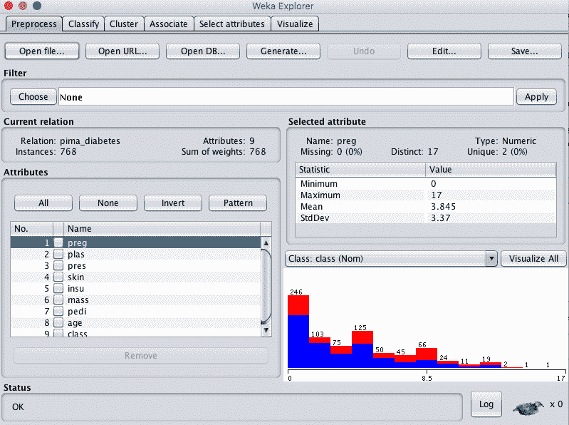
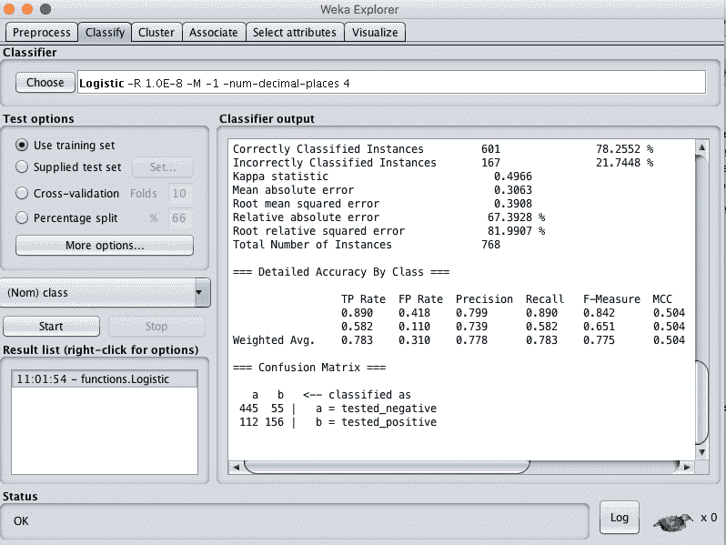
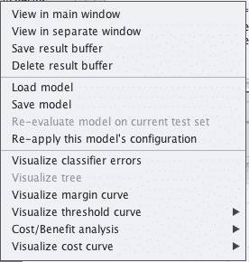
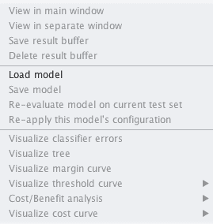
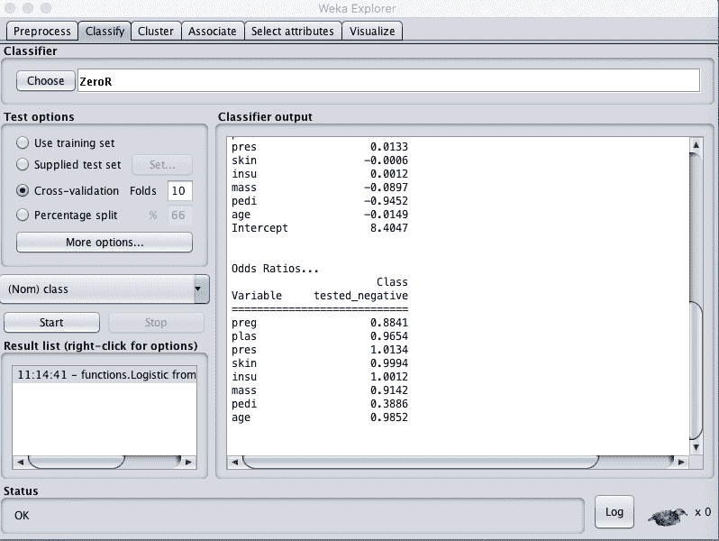
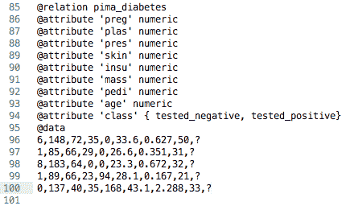
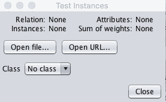
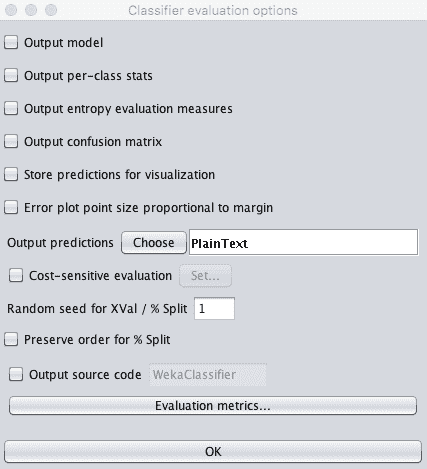
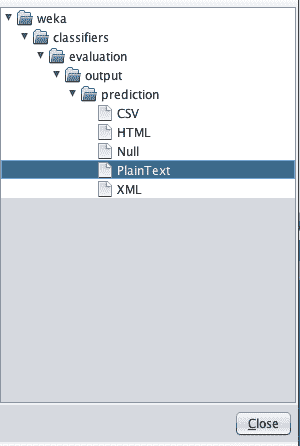
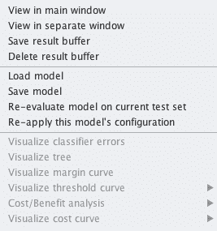

# 如何保存你的机器学习模型并在 Weka 中做出预测

> 原文：<https://machinelearningmastery.com/save-machine-learning-model-make-predictions-weka/>

最后更新于 2020 年 12 月 10 日

找到表现良好的机器学习模型并对其进行调整后，您必须最终确定模型，以便能够对新数据进行预测。

在这篇文章中，你将发现如何最终确定你的机器学习模型，将其保存到文件中，并在以后加载，以便对新数据进行预测。

看完这篇文章你会知道:

*   如何在 Weka 中训练你的机器学习模型的最终版本。
*   如何将最终模型保存到文件中。
*   如何在以后加载最终模型，并使用它对新数据进行预测。

**用我的新书[用 Weka](https://machinelearningmastery.com/machine-learning-mastery-weka/) 启动你的项目**，包括*的分步教程*和清晰的*截图*所有示例。

我们开始吧。

如何保存您的机器学习模型并在 Weka 中进行预测[尼克·肯里克](https://www.flickr.com/photos/zedzap/16220684689/)摄，版权所有。

## 教程概述

本教程分为 4 个部分:

1.  **定型模型**在这里您将发现如何训练模型的定型版本。
2.  **保存模型**在这里你会发现如何将模型保存到文件中。
3.  **加载模型**您将发现如何从文件中加载模型。
4.  **进行预测**在这里你会发现如何对新数据进行预测。

本教程提供了一个模板，您可以使用它来完成自己的数据问题机器学习算法。

我们将使用皮马印第安人糖尿病发病数据集。每个实例代表一名患者的医疗细节，任务是预测该患者是否会在未来五年内出现糖尿病。有 8 个数值输入变量，并且都有不同的标度。

*   [数据集文件](https://raw.githubusercontent.com/jbrownlee/Datasets/master/pima-indians-diabetes.csv)。
*   [数据集详细信息](https://raw.githubusercontent.com/jbrownlee/Datasets/master/pima-indians-diabetes.names)。

最高的结果大约是 77%的准确率。

我们将在这个数据集上最终确定一个逻辑回归模型，这既是因为它是一个简单的算法，容易理解，也是因为它在这个问题上做得很好。

## 1.最终确定机器学习模型

也许机器学习项目中最被忽视的任务是如何最终确定你的模型。

一旦你完成了准备数据、比较算法并根据你的问题调整它们的所有工作，你实际上需要创建你打算用来进行新预测的最终模型。

最终确定一个模型包括在您拥有的整个训练数据集上训练模型。

1.打开 Weka 图形用户界面选择器。

2.点击“浏览器”按钮，打开 Weka 浏览器界面。

3.从*数据/diabetes.arff* 文件中加载皮马印第安人糖尿病发病数据集。

Weka 负荷皮马印度人糖尿病发病数据集

4.单击“分类”选项卡打开分类器。

5.点击“选择”按钮，选择“功能”组下的“物流”。

6.选择“测试选项”下的“使用训练集”。

7.单击“开始”按钮。

Weka 列车逻辑回归模型

这将在整个加载的数据集上训练所选的逻辑回归算法。它还将在整个数据集上评估模型，但我们对这种评估不感兴趣。

假设您已经使用交叉验证评估了模型在未知数据上的表现，作为选择您希望最终确定的算法的一部分。当你需要告知他人你的模型的技能时，你可以报告你之前准备的评估。

既然我们已经最终确定了模型，我们需要将其保存到文件中。

## 2.将最终模型保存到文件

继续上一节，我们需要将最终模型保存到磁盘上的一个文件中。

这是为了我们可以在以后加载它，甚至在未来的不同计算机上使用它来进行预测。我们将来不需要训练数据，只需要数据的模型。

您可以轻松地将训练好的模型保存到 Weka Explorer 界面中的文件中。

1.在“分类”选项卡的“结果列表”中，右键单击模型的结果项。

2.从右键菜单中单击“保存模型”。

Weka 将模型保存到文件

3.选择一个位置并输入文件名，如“物流”，点击“保存”按钮。

您的模型现在保存到文件“logistic.model”中。

它是二进制格式(不是文本)，可以被 Weka 平台再次读取。因此，记下您用来创建模型文件的 Weka 版本是一个好主意，以防将来您需要相同版本的 Weka 来加载模型并进行预测。一般来说，这不会是一个问题，但这是一个很好的安全预防措施。

你现在可以关闭 Weka 浏览器了。下一步是发现如何加载保存的模型。

## 3.加载最终模型

您可以从文件中加载保存的 Weka 模型。

Weka 浏览器界面使这变得容易。

1.打开 Weka 图形用户界面选择器。

2.点击“浏览器”按钮，打开 Weka 浏览器界面。

3.加载任何旧数据集，都没有关系。我们不会使用它，我们只需要加载一个数据集来访问“分类”选项卡。如果不确定，再次加载*数据/diabetes.arff* 文件。

4.单击“分类”选项卡打开分类器。

5.右键单击“结果列表”，然后单击“加载模型”，选择上一节“逻辑模型”中保存的模型。

从文件加载模型

模型现在将被加载到资源管理器中。

我们现在可以使用加载的模型来预测新数据。

从准备使用的文件加载的 Weka 模型

## 4.对新数据进行预测

我们现在可以根据新数据做出预测。

首先，让我们创建一些假装的新数据。将文件 *data/diabetes.arff* 复制一份，保存为*data/diabetes-new-data . ARFF*。

在文本编辑器中打开文件。

用第 95 行的@data 找到文件中实际数据的开头。

我们只想保留 5 条记录。向下移动 5 行，然后删除文件的所有剩余行。

我们想要预测的类值(输出变量)在每一行的末尾。删除 5 个输出变量中的每一个，并用问号符号(？).

用于进行新预测的 Weka 数据集

我们现在有“看不见的”数据，没有已知的输出，我们想对其进行预测。

从教程的前一部分继续，我们已经加载了模型。

1.在“分类”选项卡上，选择“测试选项”窗格中的“提供的测试集”选项。

Weka 选择要进行新预测的新数据集

2.单击“设置”按钮，单击选项窗口上的“打开文件”按钮，选择我们刚刚创建的名为“糖尿病-新-数据. arff”的模拟新数据集。单击窗口上的“关闭”。

3.单击“更多选项...”按钮，调出评估分类器的选项。

4.取消选中我们不感兴趣的信息，特别是:

*   “输出模型”
*   "输出每类统计信息"
*   “输出混淆矩阵”
*   “存储可视化预测”

用于预测的 Weka 定制测试选项

5.对于“输出预测”选项，单击“选择”按钮并选择“明文”。

纯文本格式的 Weka 输出预测

6.单击“确定”按钮确认分类器评估选项。

7.在“结果列表”窗格中右键单击已加载模型的列表项。

8.选择“在当前测试集上重新评估模型”。

weka 根据测试数据重新评估加载模型并做出预测

然后在“分类器输出”窗格中列出每个测试实例的预测。具体来说，结果的中间一列有“测试阳性”和“测试阴性”这样的预测。

您可以为预测选择另一种输出格式，例如 CSV，稍后可以将其加载到 Excel 等电子表格中。例如，下面是 CSV 格式的相同预测的示例。

Weka 用加载模型对新数据的预测

## 更多信息

Weka Wiki 提供了更多关于保存和加载模型以及做出您可能会发现有用的预测的信息:

*   [保存和加载模型](https://waikato.github.io/weka-wiki/saving_and_loading_models/)
*   [做预测](https://waikato.github.io/weka-wiki/making_predictions/)

## 摘要

在这篇文章中，你发现了如何最终确定你的模型，并对新的未知数据做出预测。你可以看到如何使用这个过程来自己对新数据进行预测。

具体来说，您了解到:

*   如何训练机器学习模型的最终实例？
*   如何将最终模型保存到文件中以备后用？
*   如何从文件中加载模型，并使用它对新数据进行预测。

你对如何在 Weka 最终确定你的模型或这篇文章有什么问题吗？在下面的评论中提出你的问题，我会尽力回答。