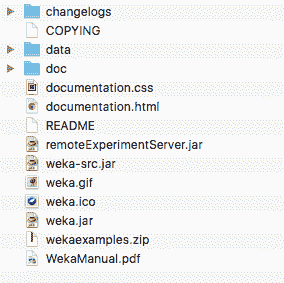
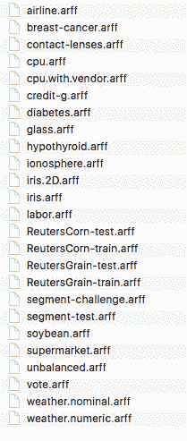

# Weka 中用于练习的标准机器学习数据集

> 原文：<https://machinelearningmastery.com/standard-machine-learning-datasets-used-practice-weka/>

最后更新于 2020 年 12 月 10 日

在开始机器学习和学习一个新工具时，拥有小的、理解良好的数据集是一个好主意。

Weka 机器学习工作台在已安装的目录中提供了一个小数据集的目录。

在这篇文章中，你将发现一些与 Weka 一起分发的小的、被很好理解的数据集，它们的细节以及在哪里可以了解到更多关于它们的信息。

我们将关注少数不同类型的数据集。看完这篇文章你会知道:

*   样本数据集位于何处，或者如果需要，可以从何处重新下载。
*   您可以使用特定的标准数据集来探索分类和回归预测模型的不同方面。
*   哪里可以获得更多关于特定数据集和最新结果的信息。

**用我的新书[用 Weka](https://machinelearningmastery.com/machine-learning-mastery-weka/) 启动你的项目**，包括*的分步教程*和清晰的*截图*所有示例。

我们开始吧。


标准机器学习数据集用于实践 Weka
照片由[马文·福希](https://www.flickr.com/photos/amon-ra123m5/5624590992)拍摄，保留部分权利。

## 标准 Weka 数据集

开源 Weka 机器学习工作台的安装包括一个充满标准机器学习问题的 *data/* 目录。



Weka 安装目录

当您开始学习机器学习或学习如何开始使用 Weka 平台时，这非常有用。它为常见的分类和回归问题提供了标准的机器学习数据集，例如，下面是该目录的快照:



Weka 安装目录中提供的数据集

所有数据集都是 Weka 本地 ARFF 文件格式，可以直接加载到 Weka，这意味着您可以立即开始开发实践模型。

有一些特殊的 Weka 发行版可能不包括数据/目录。如果您选择安装其中一个发行版，您可以[下载。对 Weka](https://waikato.github.io/weka-wiki/downloading_weka/) 进行 zip 分发，解压后将*数据/* 目录复制到某个你可以从 Weka 轻松访问的地方。

在 *data/* 目录中有很多数据集可以使用，在接下来的部分中，我将指出一些您可以关注的练习和研究预测建模问题的数据集。

## 二元类别数据集

二进制分类是指待预测的输出变量标称由两类组成。

这可能是研究得最透彻的一类预测建模问题，也是最好的一类问题。

在*数据/* 目录中有三个标准的二进制分类问题可以重点关注:

1.  **皮马印第安人糖尿病发作** : ( *diabetes.arff* )每个实例代表一名患者的医疗细节，任务是预测该患者是否会在未来五年内出现糖尿病发作。有 8 个数值输入变量，它们都有不同的标度。[你可以了解更多这个数据集](https://raw.githubusercontent.com/jbrownlee/Datasets/master/pima-indians-diabetes.names)。[最高结果在 77%准确率的数量级](http://www.is.umk.pl/projects/datasets.html#Diabetes)。
2.  **乳腺癌** : ( *乳腺癌. arff* )每个实例代表患者的医疗细节及其肿瘤组织样本，任务是预测患者是否患有乳腺癌。有 9 个输入变量，它们都是标称值。您可以在 [UCI 机器学习资源库](https://archive.ics.uci.edu/ml/datasets/Breast+Cancer)中了解更多数据集。[最高结果在 75%准确度的数量级](http://www.is.umk.pl/projects/datasets.html#Ljubljana)。
3.  **电离层** ( *电离层. arff* )每个实例都描述了来自大气的雷达回波的属性，任务是预测电离层中是否存在结构。有 34 个数值输入变量，通常具有相同的规模。您可以在 [UCI 机器学习资源库](https://archive.ics.uci.edu/ml/datasets/Ionosphere)上了解更多关于该数据集的信息。[最高结果在 98%准确率的数量级](http://www.is.umk.pl/projects/datasets.html#Ionosphere)。

## 多类类别数据集

有许多分类类型问题，其中输出变量有两个以上的类。这些被称为多类分类问题。

当你对二进制分类有了一些信心后，这是一个很好的问题类型。

在*数据/* 目录中，你可以关注的三个标准多类分类问题是:

1.  **鸢尾花分类** : ( *iris.arff* )每个实例描述了鸢尾花的测量，任务是预测观察属于哪 3 种鸢尾花。有 4 个数值输入变量，单位相同，尺度一般相同。您可以在 [UCI 机器学习资源库](https://archive.ics.uci.edu/ml/datasets/Iris)中了解更多数据集。最高的结果大约是 96%的准确率。
2.  **大型大豆数据库** : ( *黄豆. arff* )每个实例描述了一种大豆作物的特性，任务是预测该作物遭受 19 种疾病中的哪一种。有 35 个标称输入变量。您可以在 [UCI 机器学习资源库](https://archive.ics.uci.edu/ml/datasets/Soybean+(Large))上了解更多关于该数据集的信息。
3.  **玻璃鉴定** : ( *glass.arff* )每个实例描述了玻璃样品的化学成分，任务是从 7 个类别之一预测该类别的类型或用途。有 10 个数字属性描述了玻璃的化学性质和折射率。您可以在 [UCI 机器学习资源库](https://archive.ics.uci.edu/ml/datasets/Glass+Identification)上了解更多关于该数据集的信息。

## 回归数据集

回归问题是那些你必须预测一个真正有价值的输出的问题。

*数据/* 目录中回归问题的选择较少。回归是一类重要的预测建模问题。因此，我建议下载从 UCI 机器学习资源库收集的回归问题的免费附加包。

它可从 Weka 网页上的[数据集页面获得，是列表中的第一个，名为:](https://sourceforge.net/projects/weka/files/datasets/)

*   包含 37 个回归问题的 jar 文件，从各种来源获得(*数据集-numeric.jar* )

它是一个. jar 文件，是一种压缩的 Java 档案。你应该可以用大多数现代的解压程序来解压。

如果您安装了 Java(很可能使用 Weka)，您也可以解压缩。在下载 jar 的目录中，使用以下命令在命令行上手动创建 jar 文件:

```py
jar -xvf datasets-numeric.jar
```

解压缩文件将创建一个名为*数值*的新目录，其中包含 37 个 ARFF 本地 Weka 格式的回归数据集。

*数值/* 目录中您可以关注的三个回归数据集是:

1.  **龙利经济数据集** : ( *龙利. arff* )每个实例描述了一个国家在给定年份的总经济属性，任务是将就业人数预测为整数。有 6 个不同比例的数字输入变量。
2.  **波士顿房价数据集** : ( *housing.arff* )每个实例描述了波士顿郊区的房产，任务是以千美元为单位预测房价。有 13 个不同尺度的数值输入变量描述郊区的特性。您可以在 [UCI 机器学习资源库](https://archive.ics.uci.edu/ml/datasets/Housing)上了解更多关于该数据集的信息。
3.  **哺乳动物中的睡眠数据集** : ( *sleep.arff* )每个实例描述了不同哺乳动物的属性，任务是预测它们平均需要的总睡眠小时数。有 7 个不同尺度和度量的数字输入变量。

## 摘要

在这篇文章中，您发现了与 Weka 机器学习平台一起分发的标准机器学习数据集。

具体来说，您了解到:

*   你可以在实践中使用的三个流行的二分类问题:糖尿病、乳腺癌和电离层。
*   三个流行的多类分类问题，你可以用来练习:鸢尾，大豆和玻璃。
*   三个流行的回归问题，你可以用来练习:龙利，住房和睡眠。

你对 Weka 中的标准机器学习数据集或这篇文章有什么问题吗？在评论中提问，我会尽力回答。