# Weka 机器学习工作台之旅

> 原文：<https://machinelearningmastery.com/tour-weka-machine-learning-workbench/>

最后更新于 2019 年 8 月 22 日

Weka 是一个易用且功能强大的机器学习平台。

它提供了大量的机器学习算法、特征选择方法和数据准备过滤器。

在这篇文章中，您将发现 Weka 机器学习工作台，并参观您可以在机器学习项目中使用的关键界面。

看完这篇文章，你会知道:

*   Weka 机器学习工作台支持的接口。
*   初学者推荐的解决问题的接口，以及不推荐的接口。
*   如何至少在 Weka 中点击你需要的每个按键界面并生成一个结果。

**用我的新书[用 Weka](https://machinelearningmastery.com/machine-learning-mastery-weka/) 启动你的项目**，包括*的分步教程*和清晰的*截图*所有示例。

我们开始吧。

## Weka 图形用户界面选择器

进入 Weka 界面的入口是 Weka 图形用户界面选择器。

这是一个界面，让你选择和启动一个特定的 Weka 环境。

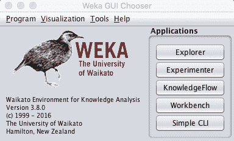

Weka 图形用户界面选择器截图

除了提供对核心 Weka 工具的访问之外，菜单中还提供了许多其他实用程序和工具。

“工具”菜单中有两个重要的实用程序需要注意:

1.包管理器，让你浏览和安装第三方插件到 Weka，如新算法。

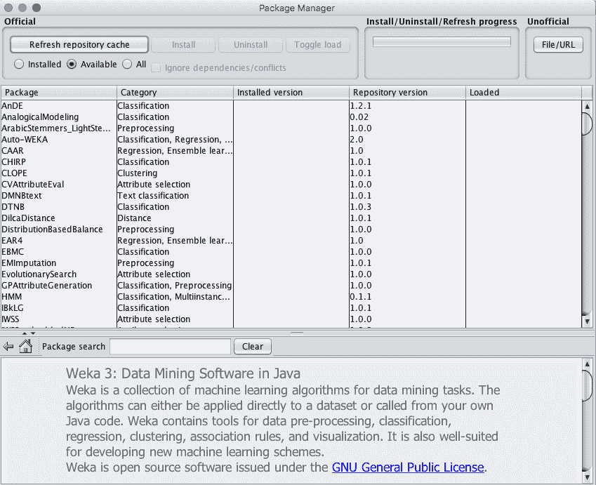

Weka 包管理器截图

2.ARFF 查看器允许您加载和转换数据集，并以 ARFF 格式保存它们。

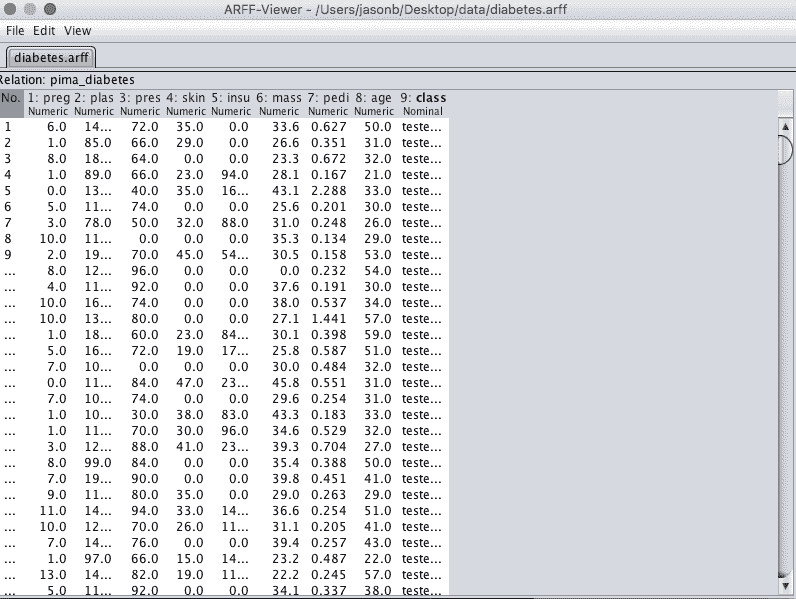

Weka ARFF 浏览器截图

## Weka 探险家

Weka Explorer 旨在研究您的机器学习数据集。

当您考虑不同的数据转换和建模算法时，这很有用，您可以稍后通过受控实验进行研究。它非常适合获取想法和播放假设场景。

界面分为 6 个选项卡，每个选项卡都有特定的功能:

预处理选项卡用于加载数据集，并应用过滤器将数据转换成一种形式，以便更好地向建模过程揭示问题的结构。还提供了一些关于加载数据的汇总统计信息。

在您的 Weka 安装的*数据/* 目录中加载一个标准数据集，特别是*数据/乳腺癌. arff* 。这是一个二分类问题，我们将在这次旅行中使用。

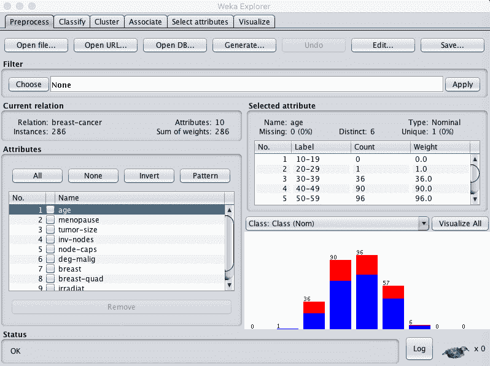

Weka 浏览器预处理选项卡截图

分类选项卡用于训练和评估不同机器学习算法在分类或回归问题上的表现。算法被分成组，结果被保存在结果列表中，并在主分类器输出中总结。

单击“开始”按钮，在数据集上运行 ZeroR 分类器并总结结果。

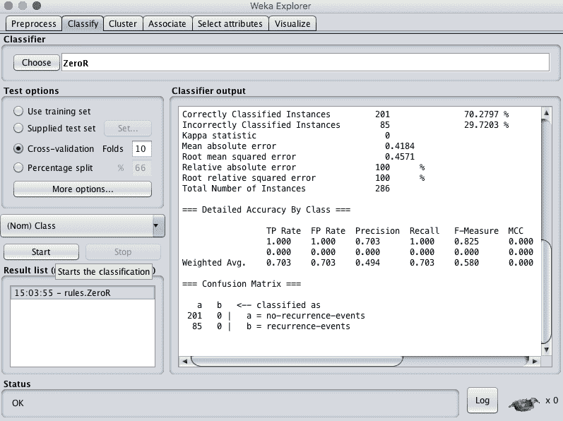

Weka 浏览器分类标签截图

“聚类”选项卡用于训练和评估不同无监督聚类算法在未标记数据集上的表现。像“分类”选项卡一样，算法被分成组，结果保存在结果列表中，并在主集群器输出中汇总。

单击“开始”按钮，在数据集上运行 EM 聚类算法并总结结果。

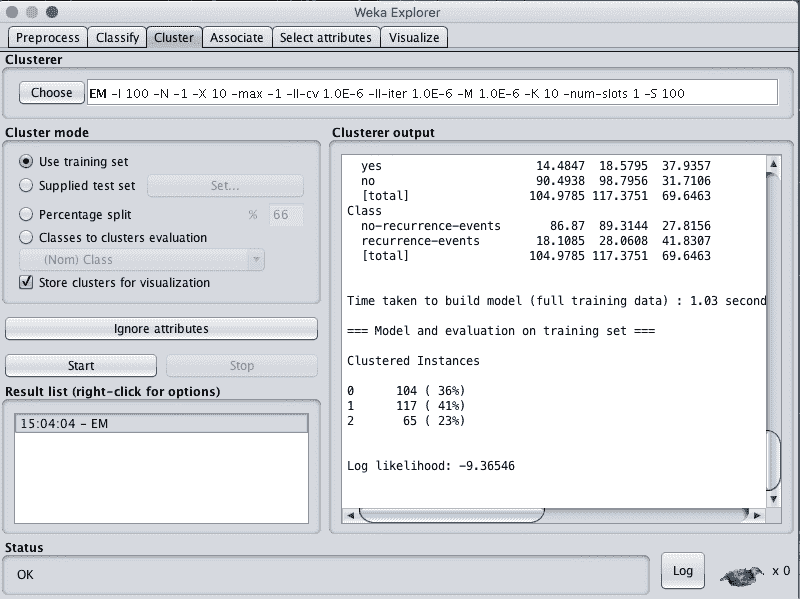

Weka 浏览器集群选项卡截图

“关联”选项卡用于自动查找数据集中的关联。这些技术通常用于市场篮子分析类型的数据挖掘问题，并且需要所有属性都是分类的数据。

单击“开始”按钮，在数据集上运行 Apriori 关联算法并总结结果。

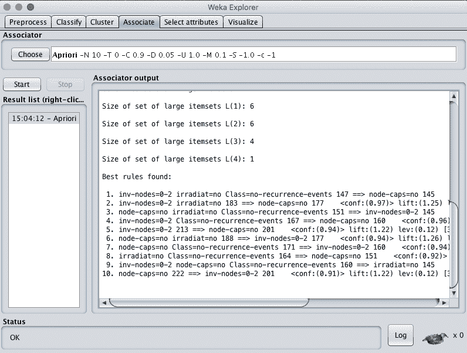

Weka 资源管理器关联选项卡的屏幕截图

“选择属性”选项卡用于对加载的数据集执行特征选择，并识别最有可能与开发预测模型相关的特征。

点击“开始”按钮运行*cfssusheval*算法，在数据集上进行*最佳第一*搜索并总结结果。

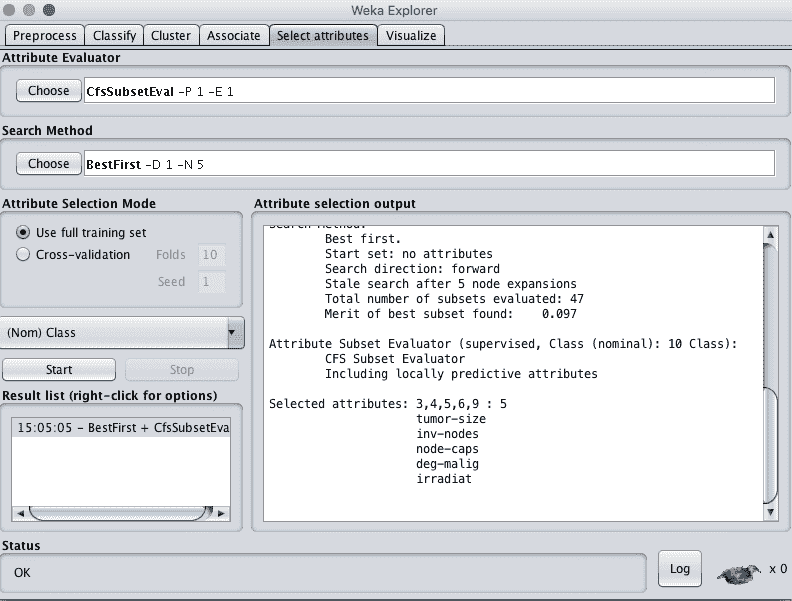

Weka 浏览器选择属性选项卡截图

可视化选项卡用于查看加载数据集中每个属性相对于其他属性的成对散点图矩阵。了解属性的形状和关系有助于数据过滤、转换和建模，这很有用。

增加点的大小和抖动，点击“更新”按钮，设置加载数据集分类属性的改进图。

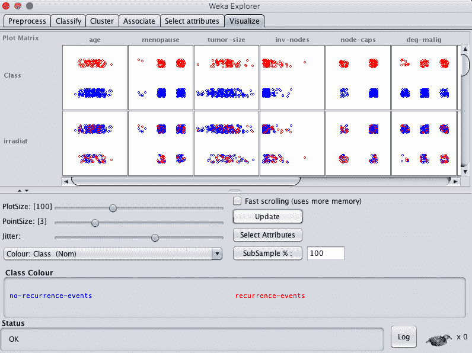

Weka 资源管理器可视化选项卡

## Weka 实验环境

Weka 实验环境用于设计受控实验，运行它们，然后分析收集的结果。

这是使用 Weka Explorer 后的下一步，您可以加载数据集的一个或多个视图和一套算法，并设计一个实验来找到表现最佳的组合。

界面分为 3 个选项卡。

设置选项卡用于设计实验。这包括写入结果的文件、如何评估计法的测试设置、要建模的数据集以及建模它们的算法。实验的细节可以保存下来供以后使用和修改。

*   单击“新建”按钮创建新实验。
*   单击数据集窗格中的“添加新...”按钮，选择*数据/糖尿病. arff* 数据集。
*   单击“算法”窗格中的“添加新...”按钮，然后单击“确定”添加 ZeroR 算法。

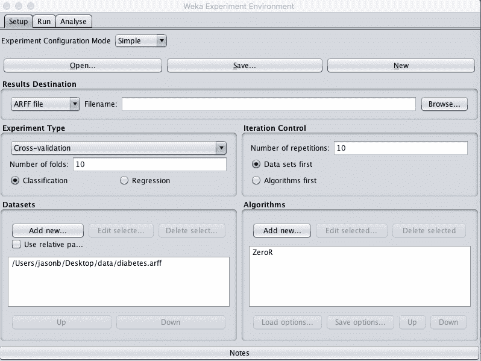

Weka 实验环境设置选项卡截图

运行选项卡用于运行您设计的实验。实验可以开始和停止。没什么大不了的。

点击“开始”按钮运行您设计的小实验。

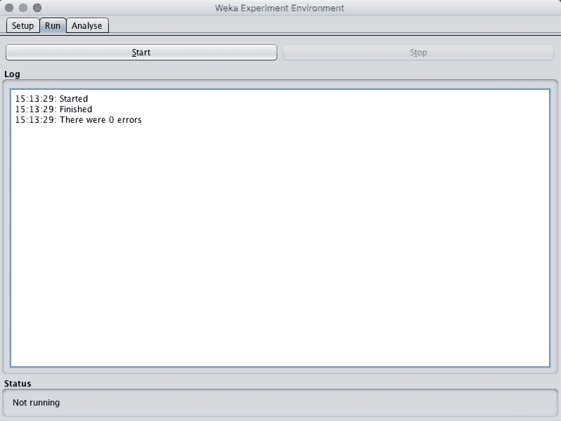

Weka 实验环境运行选项卡截图

“分析”选项卡用于分析从实验中收集的结果。结果可以从文件、数据库或刚刚在工具中完成的实验中加载。从给定的实验中收集了许多表现度量，可以使用统计显著性等工具在算法之间进行比较。

*   单击“源”窗格中的“实验”按钮，加载刚刚运行的实验的结果。
*   点击“执行测试”按钮，总结实验中单个算法的分类准确率结果。

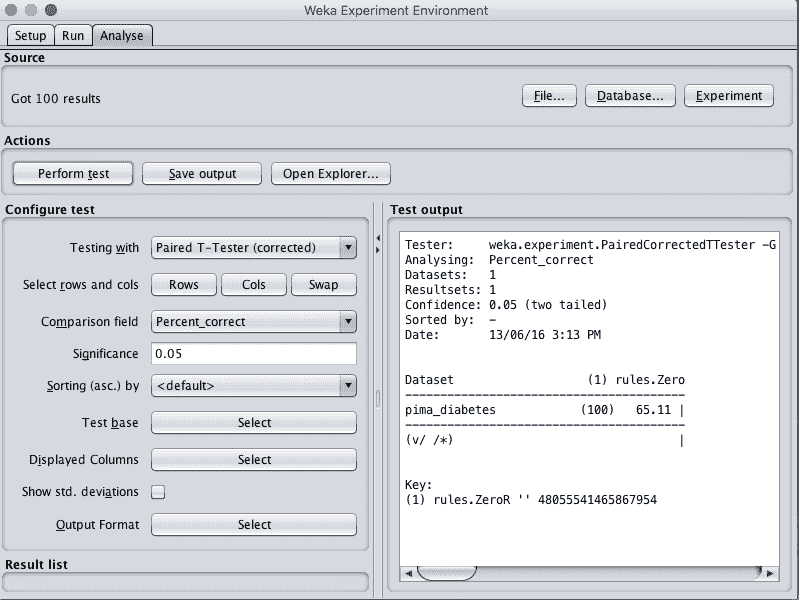

Weka 实验环境分析选项卡截图

## Weka 知识流环境

Weka KnowledgeFlow 环境是一个图形化的工作流工具，用于设计从数据源到结果摘要等的机器学习管道。设计完成后，可以在工具中执行和评估管道。

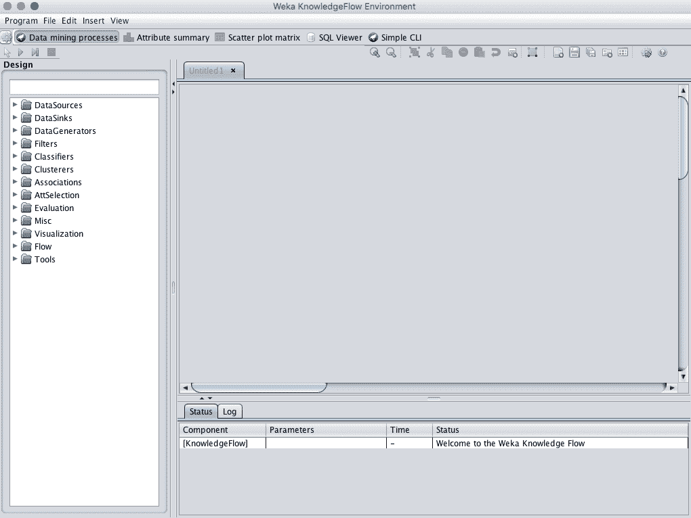

Weka 知识流环境截图

知识流环境是一个强大的工具，我不建议初学者在掌握使用 Weka 探索者和 Weka 实验环境之后使用。

## 保留工作台

Weka 工作台是一个将所有图形用户界面组合成单一界面的环境。

如果您发现自己在两个或多个不同的界面之间跳跃很多，例如在资源管理器和实验环境之间跳跃，这将非常有用。如果你在探索者中尝试了很多假设，并迅速将你学到的知识投入到受控实验中，这种情况就会发生。

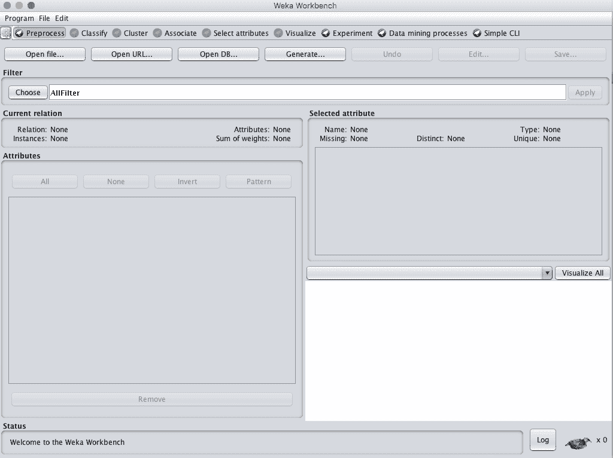

Weka 工作台截图

## 微卡简易 CLI

Weka 可以从简单的命令行界面使用。

这非常强大，因为您可以编写 shell 脚本，从带有参数的命令行调用中使用完整的 API，允许您在没有图形用户界面的情况下构建模型、运行实验和进行预测。

SimpleCLI 提供了一个环境，您可以在其中快速轻松地实验 Weka 命令行界面命令。

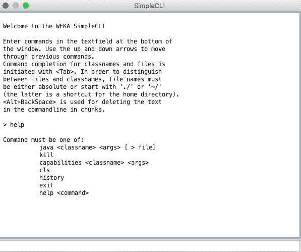

Weka 简单命令行界面截图

像 Weka KnowledgeFlow 环境一样，这是一个强大的工具，我不建议初学者在掌握使用 Weka Explorer 和 Weka 实验环境之前使用它。

## 微卡 Java API

Weka 也可以从 Java API 中使用。

这是针对 Java 程序员的，当您想要将学习或预测结合到自己的应用程序中时，这可能会很有用。

这是一个高级功能，我不建议初学者在掌握使用 Weka Explorer 和 Weka 实验环境之前使用。

## 摘要

在这篇文章中，你发现了 Weka 机器学习工作台。您浏览了一些关键界面，可以使用这些界面来探索和开发针对您自己的问题的预测性机器学习模型。

具体来说，您了解到:

*   用于数据准备、特征选择和评估计法的 Weka 浏览器。
*   设计、运行和分析受控实验结果的 Weka 实验环境。
*   用于图形化设计和执行机器学习管道的 Weka 知识流环境。
*   Weka 工作台将所有 Weka 工具整合到一个方便的界面中。
*   Weka 简单命令行界面，用于从命令行使用 Weka 应用编程接口。
*   Weka Java API，可用于将学习和预测结合到您自己的应用程序中。

你对 Weka 机器学习工作台或这篇文章有什么问题吗？在下面的评论中提出你的问题，我会尽力回答。