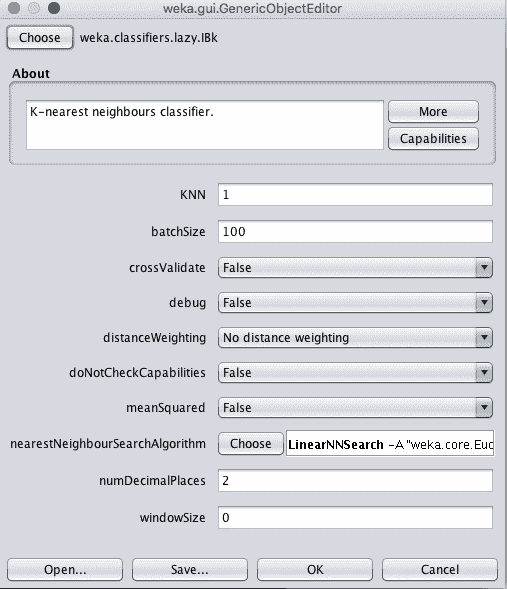
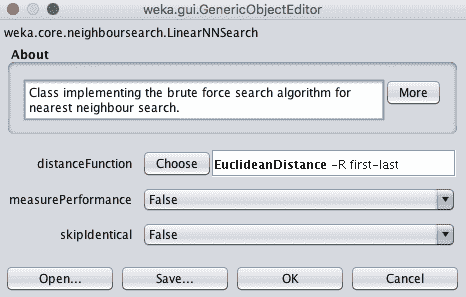
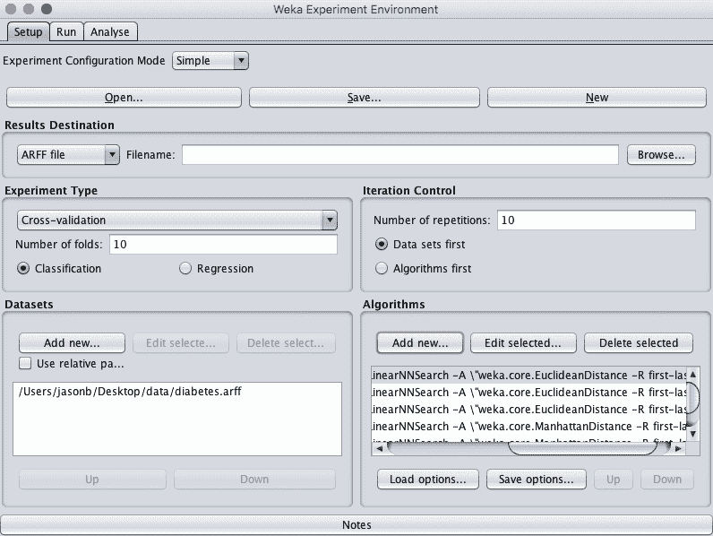
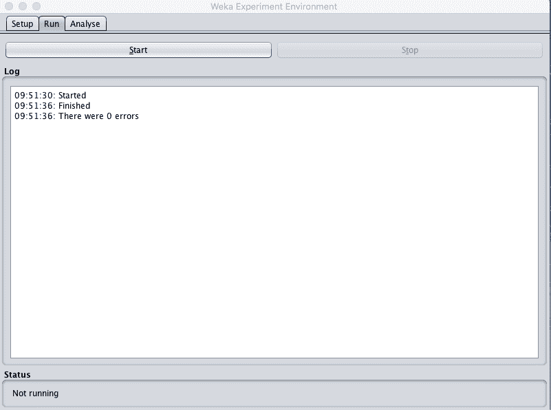
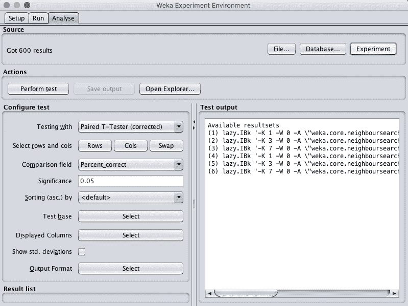
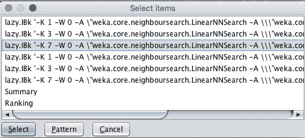

# 如何在 Weka 中调整机器学习算法

> 原文：<https://machinelearningmastery.com/tune-machine-learning-algorithms-weka/>

最后更新于 2019 年 12 月 11 日

您可以通过调整机器学习算法的参数(称为超参数)来获得最大收益。

在这篇文章中，你将发现如何在 Weka 中通过受控实验来调整机器学习算法。

看完这篇文章你会知道:

*   通过算法调整提高机器学习模型表现的重要性。
*   如何设计受控实验来调整机器学习算法的超参数？
*   如何用统计显著性来解释调整实验的结果？

**用我的新书[用 Weka](https://machinelearningmastery.com/machine-learning-mastery-weka/) 启动你的项目**，包括*的分步教程*和清晰的*截图*所有示例。

我们开始吧。


如何在 Weka
中调整机器学习算法图片由[Andrei niemimki](https://www.flickr.com/photos/andrein/6181621071/)提供，保留部分权利。

## 通过调整提高表现

机器学习算法可以被配置成引出不同的行为。

这很有用，因为它允许他们的行为适应你的机器学习问题的细节。

这也是一个困难，因为您必须选择如何配置算法，而不知道哪种配置最适合您的问题。

因此，您必须根据您的问题调整每个机器学习算法的配置参数。这通常被称为算法调整或算法超参数优化。

这是一个反复试验的经验过程。

您可以修改算法，以便发现能为您的问题带来最佳表现的参数组合，但这可能很困难，因为您必须记录所有结果并手动进行比较。

一种更稳健的方法是设计一个受控实验来评估一些预定义的算法配置，并提供工具来审查和比较结果。

Weka 实验环境提供了一个界面，允许您设计、执行和分析这些类型实验的结果。

## 算法调优实验概述

在本教程中，我们将定义一个实验来研究 k 近邻(kNN)机器学习算法的参数。

我们将研究 kNN 算法的两个参数:

1.  k 的值，它是为了进行预测而要查询的邻居的数量。
2.  距离度量，这是在查询中确定邻居以进行预测的方式。

我们将使用皮马印第安人糖尿病发病数据集。每个实例代表一名患者的医疗细节，任务是预测该患者是否会在未来五年内出现糖尿病。有 8 个数值输入变量都有不同的尺度。

*   [数据集文件](https://raw.githubusercontent.com/jbrownlee/Datasets/master/pima-indians-diabetes.csv)。
*   [数据集详细信息](https://raw.githubusercontent.com/jbrownlee/Datasets/master/pima-indians-diabetes.names)。

最高的结果大约是 77%的准确率。

本教程分为 3 个部分:

1.  设计实验
2.  运行实验
3.  查看实验结果

您可以使用这个实验设计作为基础，在自己的数据集上调整不同机器学习算法的参数。

## 1.设计实验

在这一节中，我们将定义实验。

我们将选择用于评估不同算法配置的数据集。我们还将添加 kNN 算法的多个实例(在 Weka 中称为 IBk)，每个实例都有不同的算法配置。

1.打开 Weka 图形用户界面选择器

2.点击“实验者”按钮，打开 Weka 实验者界面。


Weka 实验环境

3.在“设置”选项卡上，单击“新建”按钮开始新的实验。

4.在“数据集”面板中，点击“添加新……”按钮，选择*数据/糖尿病。*

5.在“算法”窗格中，单击“添加新...”按钮，单击“选择”按钮并选择“惰性”组下的“IBk”算法。点击“确定”按钮添加。

这增加了 k=1 和距离=欧几里德的 kNN。

使用下面列出的配置参数配置重复此过程和 IBk。k 参数可以在算法配置的“KNN”参数中指定。



WEKA k-最近邻算法配置

可以通过单击“近邻搜索算法”参数的技术名称来更改距离度量，以打开搜索方法的配置属性，然后单击“距离函数”参数的“选择”按钮。



为 k 近邻算法选择距离函数

请注意，您可以通过单击“算法”窗格中的“编辑选定的...”按钮来编辑添加到实验中的算法的配置。

*   IBk，k=3，距离函数=欧几里德
*   IBk，k=7，距离函数=欧几里德
*   IBk，k=1，distanceFunction =曼哈顿
*   IBk，k=3，distanceFunction=Manhattan
*   IBk，k=7，distanceFunction =曼哈顿

欧几里德距离是一种距离度量，当数据集中的所有输入属性具有相同的比例时，使用这种距离度量最为合适。曼哈顿距离是当输入属性具有不同的标度时最好使用的度量，例如在皮马印第安人糖尿病发作数据集的情况下。

我们预计，具有曼哈顿距离度量的 kNN 将从该实验中获得更好的总体分数。

实验使用 10 倍交叉验证(默认)。每个配置将在数据集上用不同的随机数种子评估 10 次(10 次交叉验证的 10 次运行)。对于每个评估的算法配置，这将导致 10 个略有不同的结果，这是一个小群体，我们可以稍后使用统计方法来解释。



Weka 配置算法调优实验

## 2.运行实验

现在是进行实验的时候了。

1.单击“运行”选项卡。

这里几乎没有选择。你所能做的就是开始一个实验或者停止一个正在运行的实验。

2.点击“开始”按钮并运行实验。它应该在几秒钟内完成。这是因为数据集很小。



Weka 运行算法调优实验

## 3.查看实验结果

通过单击“源”窗格中的“实验”按钮，加载我们刚刚执行的实验的结果。



Weka 加载算法调优实验结果

您将看到加载了 600 个结果。这是因为我们有 6 个算法配置，每个被评估 100 次，或者 10 倍交叉验证乘以 10 次重复。

我们将使用成对统计显著性测试，基于正确百分比来比较每种算法配置。所有默认配置。

比较的基础是列表中的第一个算法，即 k=1 且 distanceMeasure=Euclidean 的 IBK 算法，这是添加到实验中的第一个算法，也是默认选择。

单击“操作”窗格中的“执行测试”按钮。

您将看到如下所示的结果表:

```py
Tester:     weka.experiment.PairedCorrectedTTester -G 4,5,6 -D 1 -R 2 -S 0.05 -result-matrix "weka.experiment.ResultMatrixPlainText -mean-prec 2 -stddev-prec 2 -col-name-width 0 -row-name-width 25 -mean-width 0 -stddev-width 0 -sig-width 0 -count-width 5 -print-col-names -print-row-names -enum-col-names"
Analysing:  Percent_correct
Datasets:   1
Resultsets: 6
Confidence: 0.05 (two tailed)
Sorted by:  -
Date:       8/06/16 9:55 AM

Dataset                   (1) lazy.IBk | (2) lazy. (3) lazy. (4) lazy. (5) lazy. (6) lazy.
------------------------------------------------------------------------------------------
pima_diabetes            (100)   70.62 |   73.86 v   74.45 v   69.68     71.90     73.25
------------------------------------------------------------------------------------------
                               (v/ /*) |   (1/0/0)   (1/0/0)   (0/1/0)   (0/1/0)   (0/1/0)

Key:
(1) lazy.IBk '-K 1 -W 0 -A \"weka.core.neighboursearch.LinearNNSearch -A \\\"weka.core.EuclideanDistance -R first-last\\\"\"' -3080186098777067172
(2) lazy.IBk '-K 3 -W 0 -A \"weka.core.neighboursearch.LinearNNSearch -A \\\"weka.core.EuclideanDistance -R first-last\\\"\"' -3080186098777067172
(3) lazy.IBk '-K 7 -W 0 -A \"weka.core.neighboursearch.LinearNNSearch -A \\\"weka.core.EuclideanDistance -R first-last\\\"\"' -3080186098777067172
(4) lazy.IBk '-K 1 -W 0 -A \"weka.core.neighboursearch.LinearNNSearch -A \\\"weka.core.ManhattanDistance -R first-last\\\"\"' -3080186098777067172
(5) lazy.IBk '-K 3 -W 0 -A \"weka.core.neighboursearch.LinearNNSearch -A \\\"weka.core.ManhattanDistance -R first-last\\\"\"' -3080186098777067172
(6) lazy.IBk '-K 7 -W 0 -A \"weka.core.neighboursearch.LinearNNSearch -A \\\"weka.core.ManhattanDistance -R first-last\\\"\"' -3080186098777067172
```

结果令人着迷。

我们可以看到，总的来说，欧几里德距离度量获得了比曼哈顿更好的结果，但是基本算法(k=1，欧几里德)和所有三种曼哈顿距离配置之间的差异并不显著(结果值旁边没有“*”。

我们还可以看到，使用 k=3 或 k=7 的欧几里德距离确实会产生比基本算法更好的准确率，并且这种差异在统计上是显著的(结果旁边有一点“v”)。

k=7 且 distanceMeasure =欧氏的算法(3)是否明显优于其他结果？

通过选择此算法作为比较基础，我们可以轻松地执行此比较:

1.  单击“测试基地”旁边的“选择”按钮。
2.  单击第三个算法，k=7，距离度量=欧几里德。
3.  单击“选择”按钮将其作为基础。
4.  单击“执行测试”按钮创建结果报告。



Weka 选择新的测试基地进行结果分析

您将看到如下所示的结果表。

```py
Tester:     weka.experiment.PairedCorrectedTTester -G 4,5,6 -D 1 -R 2 -S 0.05 -result-matrix "weka.experiment.ResultMatrixPlainText -mean-prec 2 -stddev-prec 2 -col-name-width 0 -row-name-width 25 -mean-width 2 -stddev-width 2 -sig-width 1 -count-width 5 -print-col-names -print-row-names -enum-col-names"
Analysing:  Percent_correct
Datasets:   1
Resultsets: 6
Confidence: 0.05 (two tailed)
Sorted by:  -
Date:       8/06/16 10:00 AM

Dataset                   (3) lazy.IBk | (1) lazy. (2) lazy. (4) lazy. (5) lazy. (6) lazy.
------------------------------------------------------------------------------------------
pima_diabetes            (100)   74.45 |   70.62 *   73.86     69.68 *   71.90     73.25
------------------------------------------------------------------------------------------
                               (v/ /*) |   (0/0/1)   (0/1/0)   (0/0/1)   (0/1/0)   (0/1/0)

Key:
(1) lazy.IBk '-K 1 -W 0 -A \"weka.core.neighboursearch.LinearNNSearch -A \\\"weka.core.EuclideanDistance -R first-last\\\"\"' -3080186098777067172
(2) lazy.IBk '-K 3 -W 0 -A \"weka.core.neighboursearch.LinearNNSearch -A \\\"weka.core.EuclideanDistance -R first-last\\\"\"' -3080186098777067172
(3) lazy.IBk '-K 7 -W 0 -A \"weka.core.neighboursearch.LinearNNSearch -A \\\"weka.core.EuclideanDistance -R first-last\\\"\"' -3080186098777067172
(4) lazy.IBk '-K 1 -W 0 -A \"weka.core.neighboursearch.LinearNNSearch -A \\\"weka.core.ManhattanDistance -R first-last\\\"\"' -3080186098777067172
(5) lazy.IBk '-K 3 -W 0 -A \"weka.core.neighboursearch.LinearNNSearch -A \\\"weka.core.ManhattanDistance -R first-last\\\"\"' -3080186098777067172
(6) lazy.IBk '-K 7 -W 0 -A \"weka.core.neighboursearch.LinearNNSearch -A \\\"weka.core.ManhattanDistance -R first-last\\\"\"' -3080186098777067172
```

我们可以看到，当与具有欧几里德或曼哈顿距离的 k=1 相比时，k=7 和欧几里德距离的差异在统计上是显著的，但是无论距离度量如何，k=3 或 7 都不是显著的。

这很有帮助。它向我们表明，我们可能同样容易地使用 k=7 或 k=3 的曼哈顿或欧几里德距离，并获得类似的结果。

选择的基本算法确实具有最高的准确性，为 74.45%。这种差异可能在较低的显著性水平上具有统计学显著性，例如 20%(通过将“显著性”设置为 0.20)，但是方差会很高(5 个随机实例中有 4 个更好)，结果可能不够可靠。

这些结果在另一方面是有用的，而不是寻找“最好的”。我们也许可以看到随着 k 值的增加，准确率增加的趋势。我们可以设计一个后续实验，其中距离测量值用欧几里得距离固定，并考虑更大的 k 值。

## 摘要

在这篇文章中，你发现了如何设计受控实验来调整机器学习算法超参数。

具体来说，您了解到:

*   关于算法参数的需求和根据你的问题根据经验调整它们的重要性。
*   如何在 Weka 中设计和执行一个受控实验来调整机器学习算法的参数。
*   如何用统计学显著性解释对照实验的结果。

你对算法调优或这篇文章有什么问题吗？在评论中提出你的问题，我会尽力回答。