# 如何在 Weka 中使用分类机器学习算法

> 原文：<https://machinelearningmastery.com/use-classification-machine-learning-algorithms-weka/>

最后更新于 2019 年 8 月 22 日

Weka 提供了大量的分类算法。

大量可用的机器学习算法是使用 Weka 平台解决机器学习问题的好处之一。

在这篇文章中，你将发现如何在 Weka 中使用 5 种顶级机器学习算法。

看完这篇文章你会知道:

*   大约 5 个顶级机器学习算法，你可以用在你的分类问题上。
*   如何在 Weka 中使用 5 种顶级分类算法？
*   5 种顶级分类算法的关键配置参数。

**用我的新书[用 Weka](https://machinelearningmastery.com/machine-learning-mastery-weka/) 启动你的项目**，包括*的分步教程*和清晰的*截图*所有示例。

我们开始吧。

如何在 Weka 中使用分类机器学习算法[唐·格雷厄姆](https://www.flickr.com/photos/23155134@N06/14973386773/)摄，版权所有。

## 分类算法之旅概述

我们将带您参观 Weka 的 5 种顶级分类算法。

我们介绍的每种算法都将根据其工作原理进行简要描述，关键算法参数将突出显示，算法将在 Weka Explorer 界面中演示。

我们将回顾的 5 种算法是:

1.  逻辑回归
2.  朴素贝叶斯
3.  决策图表
4.  k-最近邻
5.  支持向量机

这 5 个算法可以作为你分类问题的起点。

一个标准的机器学习分类问题将被用来演示每个算法。具体来说，电离层二分类问题。这是一个很好的数据集来演示分类算法，因为输入变量是数字，并且都有相同的规模，问题只有两个类别可以区分。

每个例子都描述了来自大气层的雷达回波的特性，任务是预测电离层中是否有结构。有 34 个数值输入变量，通常具有相同的规模。您可以在 [UCI 机器学习资源库](https://archive.ics.uci.edu/ml/datasets/Ionosphere)上了解更多关于该数据集的信息。最高的结果大约是 98%的准确率。

启动 Weka 浏览器:

1.  打开 Weka 图形用户界面选择器。
2.  单击“浏览器”按钮打开 Weka 浏览器。
3.  从*数据/电离层. arff* 文件加载电离层数据集。
4.  单击“分类”打开“分类”选项卡。

## 逻辑回归

逻辑回归是一种二分类算法。

它假设输入变量是数字，并且具有高斯(钟形曲线)分布。这最后一点不一定是真的，因为如果你的数据不是高斯的，逻辑回归仍然可以获得好的结果。在电离层数据集的情况下，一些输入属性具有类似高斯的分布，但许多属性没有。

该算法学习每个输入值的系数，该系数被线性组合成回归函数，并使用逻辑斯蒂(s 形)函数进行变换。逻辑回归是一种快速简单的技术，但在某些问题上非常有效。

逻辑回归只支持二进制分类问题，尽管 Weka 实现已经被修改以支持多类分类问题。

选择逻辑回归算法:

1.  点击“选择”按钮，选择“功能”组下的“物流”。
2.  单击算法名称查看算法配置。

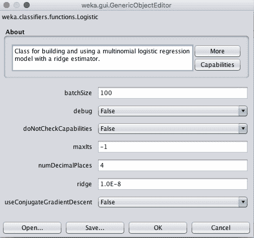

逻辑回归算法的 Weka 配置

该算法可以运行固定的迭代次数(maxIts)，但默认情况下将一直运行，直到估计算法已经收敛。

该实现使用了一种正则化类型的岭估计器。该方法试图在训练期间通过最小化模型所学习的系数来简化模型。岭参数定义了对算法施加多大的压力来减小系数的大小。将此设置为 0 将关闭此正则化。

1.  单击“确定”关闭算法配置。
2.  单击“开始”按钮，在电离层数据集上运行算法。

可以看到，在默认配置下，逻辑回归达到了 88%的准确率。

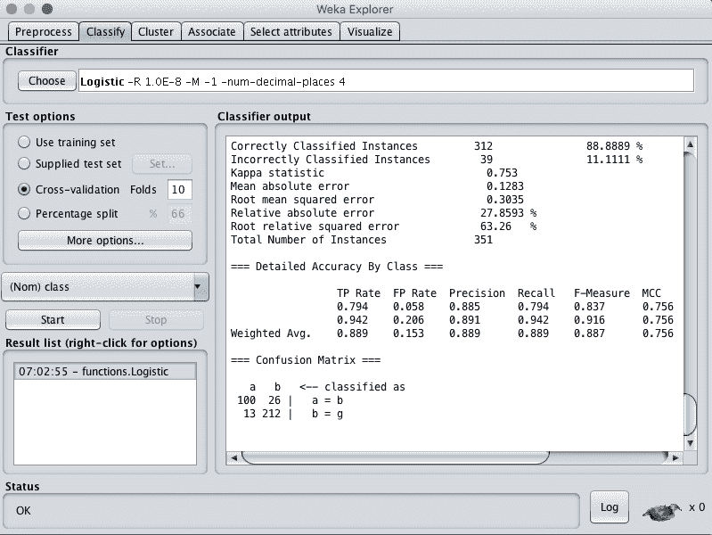

逻辑回归算法的 Weka 分类结果

## 朴素贝叶斯

朴素贝叶斯是一种分类算法。传统上，它假设输入值是标称的，尽管它通过假设分布来支持数值输入。

朴素贝叶斯使用贝叶斯定理的简单实现(因此是朴素的)，其中每个类的先验概率是根据训练数据计算的，并且被假设为彼此独立(技术上称为条件独立)。

这是一个不切实际的假设，因为我们期望变量相互作用并相互依赖，尽管这一假设使概率快速且易于计算。即使在这种不切实际的假设下，朴素贝叶斯也被证明是一种非常有效的分类算法。

朴素贝叶斯计算每个类的后验概率，并对概率最高的类进行预测。因此，它支持二分类和多类分类问题。

选择朴素贝叶斯算法:

1.  单击“选择”按钮，在“贝叶斯”组下选择“天真贝叶斯”。
2.  单击算法名称查看算法配置。

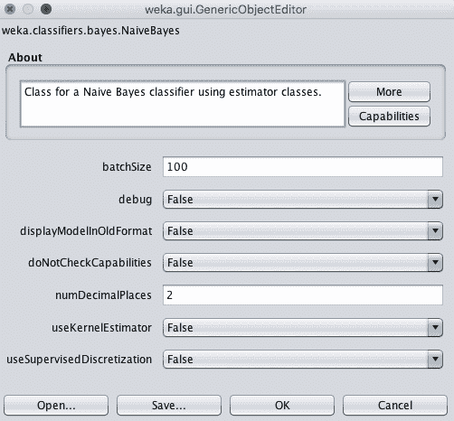

朴素贝叶斯算法的 Weka 配置

默认情况下，假设每个数字属性都是高斯分布。

您可以将算法更改为使用带有 useKernelEstimator 参数的核估计器，这可能会更好地匹配数据集中属性的实际分布。或者，您可以使用 useSupervisedDiscretization 参数自动将数字属性转换为名义属性。

1.  单击“确定”关闭算法配置。
2.  单击“开始”按钮，在电离层数据集上运行算法。

可以看到，在默认配置下，朴素贝叶斯达到了 82%的准确率。

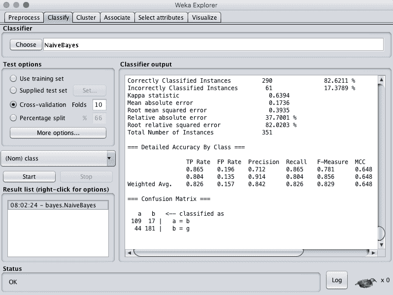

朴素贝叶斯算法的 Weka 分类结果

你可以使用许多其他风格的朴素贝叶斯算法。

## 决策图表

决策树可以支持分类和回归问题。

决策树最近被称为分类和回归树。他们通过创建一棵树来评估一个数据实例，从树的根开始，将城镇移动到叶子(根)，直到可以进行预测。创建决策树的过程是贪婪地选择最佳分割点以进行预测，并重复该过程，直到树达到固定深度。

在构建树之后，对其进行修剪，以提高模型推广到新数据的能力。

选择决策树算法:

1.  单击“选择”按钮，选择“树”组下的“重新生成树”。
2.  单击算法名称查看算法配置。

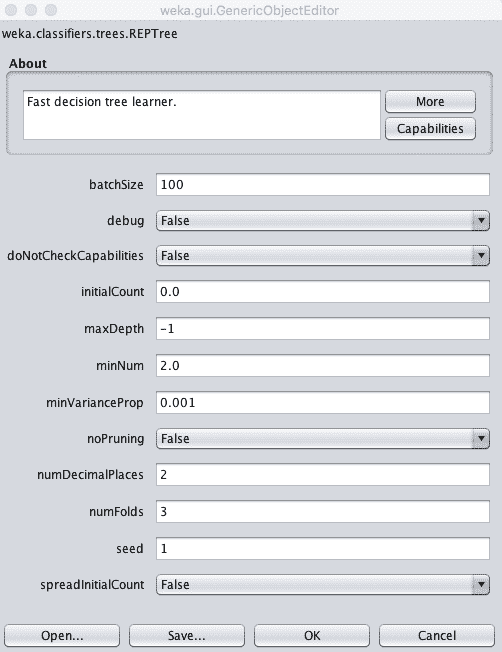

决策树算法的 Weka 配置

树的深度是自动定义的，但是深度可以在 maxDepth 属性中指定。

您也可以通过将“不运行”参数设置为“真”来选择关闭修剪，尽管这可能会导致更差的表现。

minNum 参数定义了从训练数据构建树时，树在叶节点中支持的最小实例数。

1.  单击“确定”关闭算法配置。
2.  单击“开始”按钮，在电离层数据集上运行算法。

可以看到，在默认配置下，决策树算法达到了 89%的准确率。

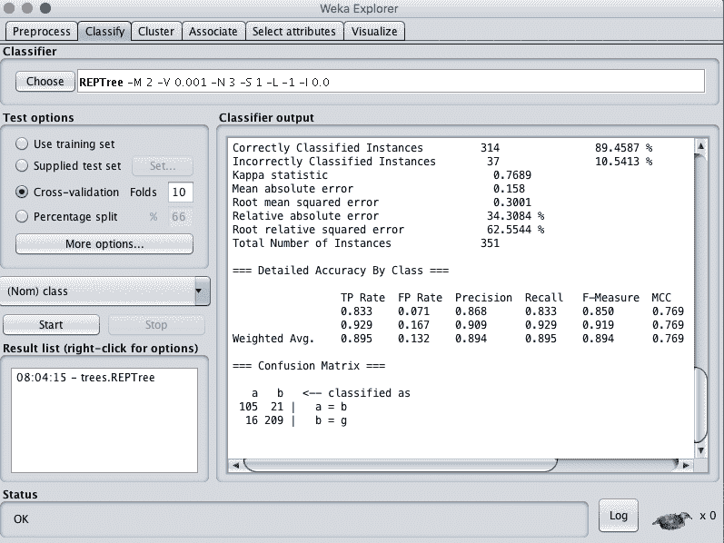

决策树算法的 Weka 分类结果

你可以使用的另一个更高级的决策树算法是 C4.5 算法，在 Weka 中称为 J48。

您可以通过右键单击“结果列表”并单击“可视化树”来查看在整个训练数据集上准备的决策树可视化。

决策树的 Weka 可视化

## k-最近邻

k 近邻算法支持分类和回归。也简称 kNN。

它的工作原理是存储整个训练数据集，并在进行预测时查询它来定位 k 个最相似的训练模式。因此，除了原始训练数据集之外，没有其他模型，并且执行的唯一计算是在请求预测时查询训练数据集。

这是一个简单的算法，但是除了假设数据实例之间的距离在进行预测时有意义之外，它并没有对问题做出太多假设。因此，它通常会获得非常好的表现。

在对分类问题进行预测时，KNN 将采用训练数据集中 k 个最相似实例的模式(最常见的类别)。

选择 k 近邻算法:

1.  点击“选择”按钮，选择“懒惰”组下的“IBk”。
2.  单击算法名称查看算法配置。

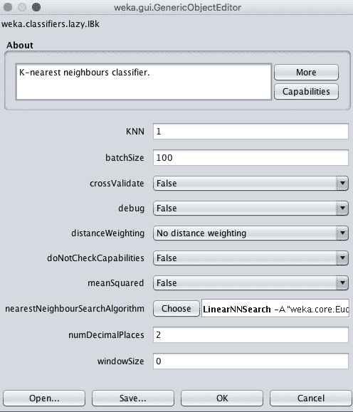

k 近邻算法的 Weka 配置

邻域的大小由 k 参数控制。

例如，如果 k 设置为 1，则使用与请求预测的给定新模式最相似的单一训练实例进行预测。k 的常用值是 3、7、11 和 21，对于较大的数据集，k 值较大。Weka 可以通过将 crossValidate 参数设置为 True，在算法内部使用交叉验证来自动发现 k 的一个好值。

另一个重要参数是使用的距离度量。这是在控制训练数据存储和搜索方式的近邻搜索算法中配置的。

默认为线性搜索。单击此搜索算法的名称将提供另一个配置窗口，您可以在其中选择距离函数参数。默认情况下，欧氏距离用于计算实例之间的距离，这对于相同比例的数值数据很有好处。如果你的属性在度量或类型上不同，曼哈顿距离是很好的选择。

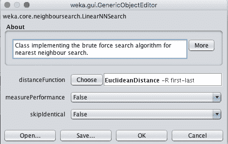

k 近邻算法中搜索算法的 Weka 配置

在你的问题上尝试一套不同的 k 值和距离度量是一个好主意，看看什么效果最好。

1.  单击“确定”关闭算法配置。
2.  单击“开始”按钮，在电离层数据集上运行算法。

可以看到，在默认配置下，kNN 算法的准确率达到了 86%。

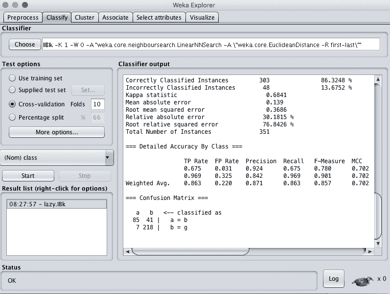

k 近邻的 Weka 分类结果

## 支持向量机

[支持向量机](https://machinelearningmastery.com/support-vector-machines-for-machine-learning/)是为二进制分类问题开发的，尽管该技术已经扩展到支持多类分类和回归问题。该算法通常简称为 SVM。

SVM 是为数字输入变量开发的，虽然会自动将标称值转换为数值。输入数据在使用前也要标准化。

SVM 的工作是找到一条线，最好地将数据分成两组。这是使用一个优化过程来完成的，该过程只考虑训练数据集中最接近类的最佳分隔线的那些数据实例。这些实例被称为支持向量，因此得名。

在几乎所有感兴趣的问题中，不能画一条线来整齐地划分类别，因此在这条线周围添加了一个边距来放松约束，允许一些实例被错误分类，但总体上允许更好的结果。

最后，很少有数据集可以用一条直线分开。有时需要标出一条有曲线甚至多边形区域的线。这是通过 SVM 将数据投影到更高维度的空间来绘制线条和进行预测来实现的。不同的内核可以用来控制投影和分离类的灵活性。

选择 SVM 算法:

1.  点击“选择”按钮，在“功能”组下选择“SMO”。
2.  单击算法名称查看算法配置。

SMO 指的是 SVM 实现中使用的特定高效优化算法，它代表顺序最小优化。

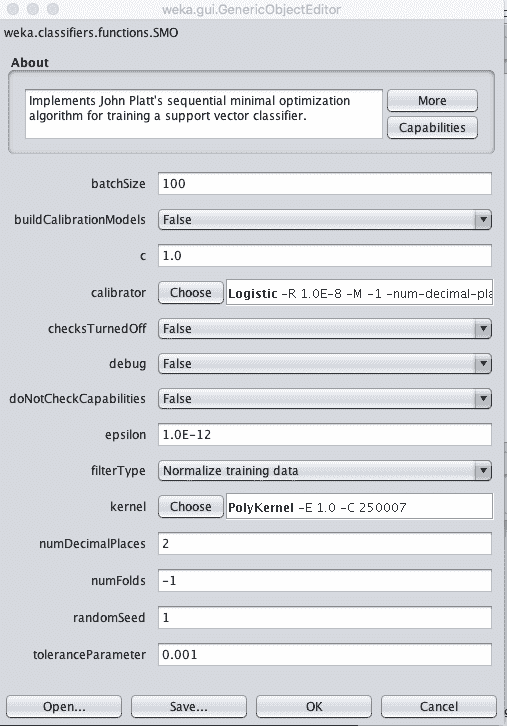

支持向量机算法的 Weka 配置

在 Weka 中被称为复杂性参数的 C 参数控制着画线来分隔类的过程的灵活性。值 0 不允许超出边距，而默认值为 1。

SVM 的一个关键参数是要使用的内核类型。最简单的核是线性核，它用直线或超平面分隔数据。Weka 中的缺省值是一个多项式内核，它将使用一条曲线或摆动线来分隔类，多项式越高，摆动越多(指数值)。

一个流行和强大的内核是径向基核或径向基函数核，它能够学习封闭的多边形和复杂的形状来划分类别。

在您的问题上尝试一套不同的内核和 C(复杂性)值是一个好主意，看看什么最有效。

1.  单击“确定”关闭算法配置。
2.  单击“开始”按钮，在电离层数据集上运行算法。

可以看到，在默认配置下，SVM 算法的准确率达到了 88%。

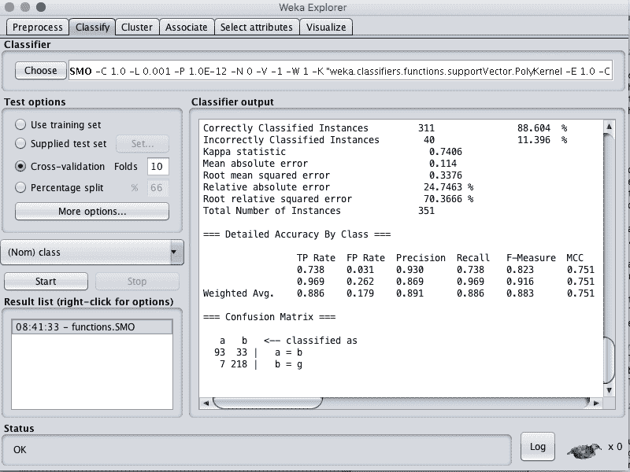

支持向量机算法的 Weka 分类结果

## 摘要

在这篇文章中，你发现了如何在 Weka 中使用顶级分类机器学习算法。

具体来说，您了解到:

*   5 个顶级分类算法，你可以自己试一试。
*   每个算法要调整的关键配置参数。
*   如何在 Weka 中使用每个算法？

你对 Weka 里的分类算法或者这个帖子有什么疑问吗？在评论中提问，我会尽力回答。