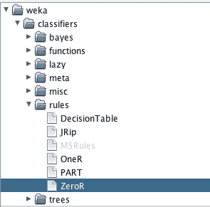
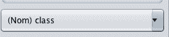
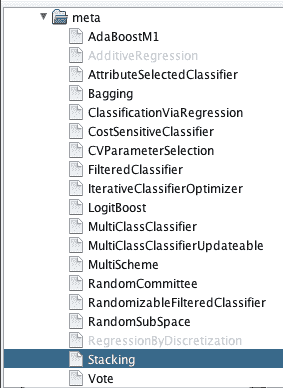
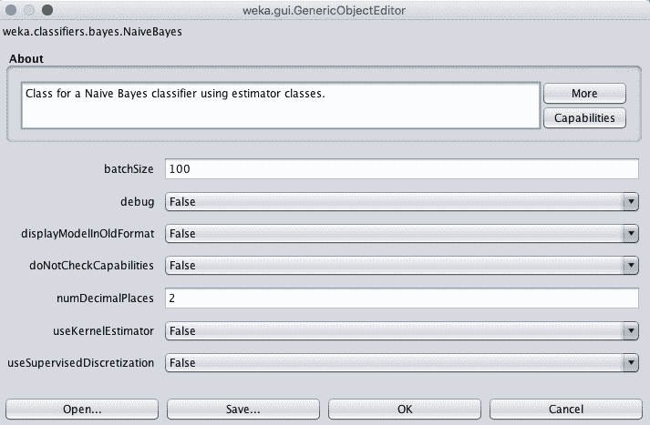
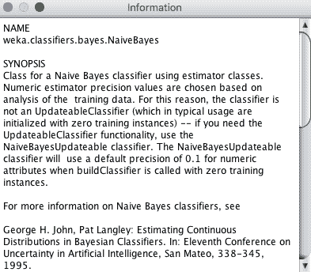
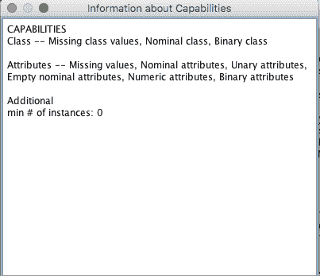

# 如何在 Weka 中使用机器学习算法

> 原文：<https://machinelearningmastery.com/use-machine-learning-algorithms-weka/>

最后更新于 2019 年 8 月 22 日

使用 Weka 平台的一大好处是支持大量的机器学习算法。

你能在你的问题上尝试的算法越多，你对你的问题的了解就越多，你就越有可能发现一个或几个表现最好的算法。

在这篇文章中，你将发现 Weka 支持的机器学习算法。

看完这篇文章你会知道:

*   Weka 支持的不同类型的机器学习算法和要尝试的关键算法。
*   如何在 Weka 中配置算法，如何保存和加载好的算法配置。
*   如何了解更多 Weka 支持的机器学习算法？

**用我的新书[用 Weka](https://machinelearningmastery.com/machine-learning-mastery-weka/) 启动你的项目**，包括*的分步教程*和清晰的*截图*所有示例。

我们开始吧。

如何在 Weka
中使用机器学习算法[欧也妮·戈洛夫科](https://www.flickr.com/photos/127534097@N04/15232292419/)摄，版权所有。

## Weka 机器学习算法

Weka 有很多机器学习算法。这很棒，这是使用 Weka 作为机器学习平台的一大好处。

不利的一面是，知道使用哪些算法以及何时使用可能会有点让人不知所措。此外，这些算法的名字可能你不熟悉，即使你在其他环境中知道它们。

在这一节中，我们将从 Weka 支持的一些众所周知的算法开始。我们将在这篇文章中学习的内容适用于整个 Weka 平台上使用的机器学习算法，但是探索者是了解更多算法的最佳场所，因为它们都可以在一个简单的地方获得。

1.  打开 Weka 图形用户界面选择器。
2.  点击“浏览器”按钮打开 Weka 浏览器。
3.  在您的 Weka 安装中打开一个数据集，例如来自 *data/diabetes.arff* 文件的 Pima Indians 数据集。
4.  单击“分类”打开“分类”选项卡。

浏览器的分类选项卡是您可以了解各种不同算法和探索预测建模的地方。

您可以通过单击“选择”按钮来选择机器学习算法。

Weka 选择机器学习算法

点击“选择”按钮，您会看到一个可供选择的机器学习算法列表。他们分为几大类:

*   **贝叶斯**:以某种核心方式使用贝叶斯定理的算法，比如朴素贝叶斯。
*   **函数**:估计函数的算法，如线性回归。
*   **懒惰**:使用懒惰学习的算法，比如 k 近邻。
*   **meta** :使用或组合多种算法的算法，如 Ensembles。
*   **杂项**:不完全适合其他组的实现，比如运行一个保存的模型。
*   **规则**:使用规则的算法，比如 One Rule。
*   **树**:使用决策树的算法，比如随机森林。

该选项卡称为“分类”，算法列在名为“分类器”的总体组下。然而，Weka 支持分类(预测一个类别)和回归(预测一个数值)预测建模问题。

您正在处理的问题类型由您希望预测的变量定义。在“分类”选项卡上，这是在测试选项下面选择的。默认情况下，Weka 选择数据集中的最后一个属性。如果属性是名义上的，那么 Weka 假设你正在处理一个分类问题。如果属性是数字，Weka 假设您正在处理一个回归问题。

Weka 选择一个输出属性进行预测

这很重要，因为您正在处理的问题的类型决定了您可以使用什么算法。例如，如果您正在处理一个分类问题，则不能使用像线性回归这样的回归算法。另一方面，如果你正在处理一个回归问题，你不能使用像逻辑回归这样的分类算法。

注意如果你被“回归”这个词搞糊涂了，那是可以的。令人困惑。回归是统计学中的一个历史词汇。它过去意味着为数字输出制作模型(回归)。它现在意味着一些算法的名字和预测一个数值。

Weka 将灰显您选择的问题不支持的算法。许多机器学习算法可以用于分类和回归。因此，无论您选择什么问题，您都可以使用一大套算法。

某些问题类型无法使用 Weka 算法

## 使用哪种算法

通常，在处理机器学习问题时，你无法事先知道哪种算法最适合你的问题。

如果你有足够的信息知道哪种算法能达到最好的表现，你可能就不会做应用机器学习了。你会做一些其他的事情，比如统计。

因此，解决办法是针对你的问题尝试一套算法，看看什么最有效。尝试一些强大的算法，然后加倍使用表现最好的 1-3 算法。他们会让你了解一般类型的算法表现良好，或学习策略，可能比平均水平更好地挑选出你的数据中的隐藏结构。

Weka 中的一些机器学习算法有非标准名称。你可能已经知道一些机器学习算法的名字，但是被 Weka 中的算法名字搞糊涂了。

下面是你应该考虑尝试的 10 个顶级机器学习算法的列表，包括它们的标准名称和 Weka 中使用的名称。

### 线性机器学习算法

线性算法假设预测属性是输入属性的线性组合。

*   线性回归:函数。线性回归
*   逻辑回归:函数。物流的

### 非线性机器学习算法

非线性算法不会对预测的输入属性和输出属性之间的关系做出强有力的假设。

*   朴素贝叶斯:贝叶斯。天真的贝叶斯
*   决策树(特别是 C4.5 变种):树。J48
*   k-最近的邻居(也叫 KNN:懒。牛传染性角膜结膜炎
*   支持向量机(也叫 SVM):函数。高年资军医(senior medical officer)
*   神经网络:功能。多层感知器

### 集成机器学习算法

集成方法结合了来自多个模型的预测，以便做出更稳健的预测。

*   随机森林:树木。随机森林
*   引导聚合(也称为装袋):元。制袋材料
*   堆叠概括(也称为[堆叠](https://machinelearningmastery.com/stacking-ensemble-for-deep-learning-neural-networks/)或混合):元。堆垛

Weka 有大量的集成方法，可能是所有流行的机器学习框架中最大的一种。

如果你正在寻找一个专门使用 Weka 的领域，Weka 是平台除了易用性之外的真正力量来源，我会指出对集成技术的支持。

## 机器学习算法配置

一旦选择了机器学习算法，就可以对其进行配置。

配置是可选的，但强烈推荐。Weka 巧妙地为每个机器学习算法选择了合理的默认值，这意味着您可以选择一个算法，并在不太了解它的情况下立即开始使用它。

为了从算法中获得最佳结果，您应该将其配置为对您的问题表现理想。

如何为您的问题配置算法？

同样，这是另一个悬而未决的问题，事先不可知。给定的算法确实有启发法可以指导你，但它们不是万灵药。真正的答案是针对你的问题系统地测试一套给定算法的标准配置。

您可以在 Weka 中配置一个机器学习算法，方法是在选择它后单击它的名称。这将启动一个窗口，显示算法的所有配置详细信息。

Weka 配置机器学习算法

您可以通过将鼠标悬停在每个选项上来了解每个配置选项的含义，该选项将显示描述配置选项的工具提示。

有些选项给你一组有限的值供你选择，其他的选择整数或实数。尝试实验和研究，以便提出 3 到 5 个标准的算法配置来解决你的问题。

您可以使用的专业技巧是将标准算法配置保存到文件中。单击算法配置底部的“保存”按钮。输入一个文件名，明确标注算法名称和要保存的配置类型。您可以稍后在 Weka 浏览器、实验者和 Weka 的其他地方加载算法配置。当您确定了一套标准算法配置，并希望在一个又一个问题上重用时，这是最有价值的。

您可以通过单击算法配置窗口上的“确定”按钮来采用和使用算法配置。

## 获取更多关于算法的信息

Weka 提供了每个支持机器学习算法的更多信息。

在算法配置窗口中，您会注意到两个按钮来了解更多关于算法的信息。

### 更多信息

单击“更多”按钮将显示一个窗口，总结算法的实现和所有算法配置属性。

关于算法的更多信息

这有助于更全面地了解算法如何工作以及如何进行配置。它还经常包括对作为算法实现基础的书籍或论文的引用。为了更好地了解如何从给定算法中获得最大收益，这些都是可以追踪和回顾的好资源。

作为一个初学者，阅读如何更好地配置算法并不是一件容易的事情，因为它可能会让你感到有些不知所措，但它是一个专业的技巧，当你对应用机器学习有更多的经验时，它将帮助你以后学习得更多更快。

### 算法能力

单击“功能”按钮将为您提供算法功能的快照。

算法的 Weka 能力

最重要的是，这有助于了解算法如何处理丢失的数据以及它对您的问题的任何其他重要期望。

查看这些信息可以让您了解如何在数据上创建新的不同视图，以提高一个或多个算法的表现。

## 摘要

在这篇文章中，你在 Weka 机器学习工作台中发现了对机器学习算法的支持。

具体来说，您了解到:

*   Weka 有大量的机器学习算法可供选择，用于分类和回归问题。
*   您可以轻松配置每个机器学习算法，并保存和加载一组标准配置。
*   您可以更深入地了解给定算法的细节，甚至发现它的来源，以便了解如何获得最佳表现。

你对 Weka 里的机器学习算法或者这个帖子有什么疑问吗？在评论中提问，我会尽力回答。