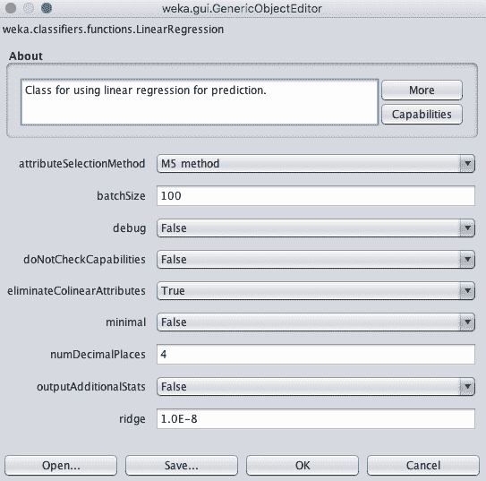
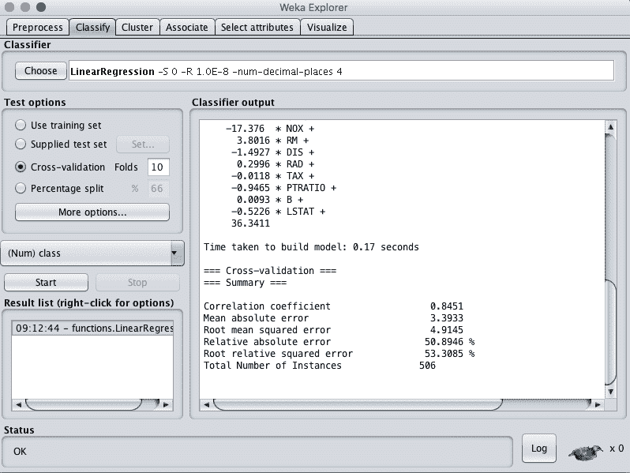
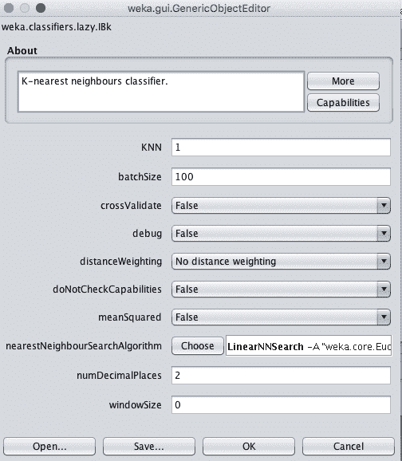
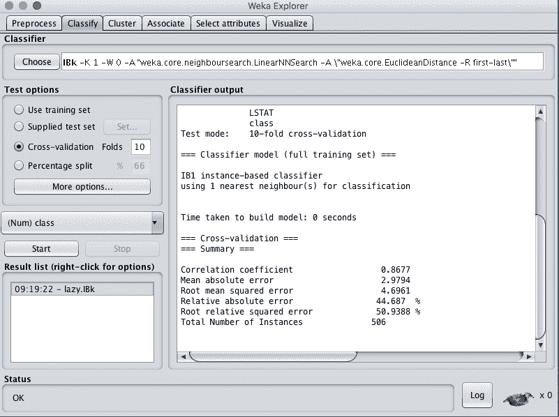
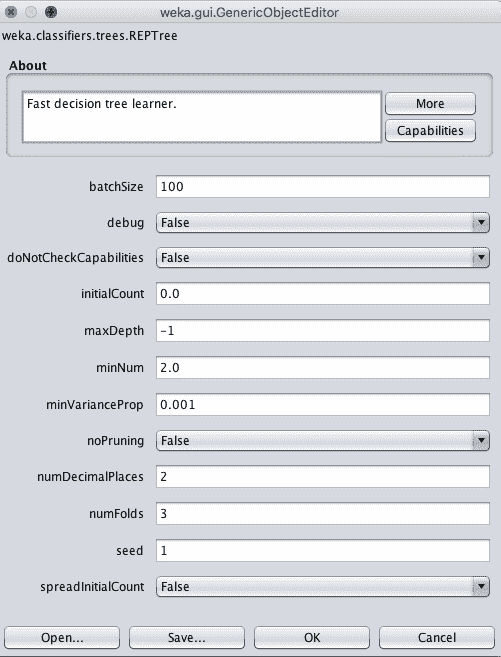
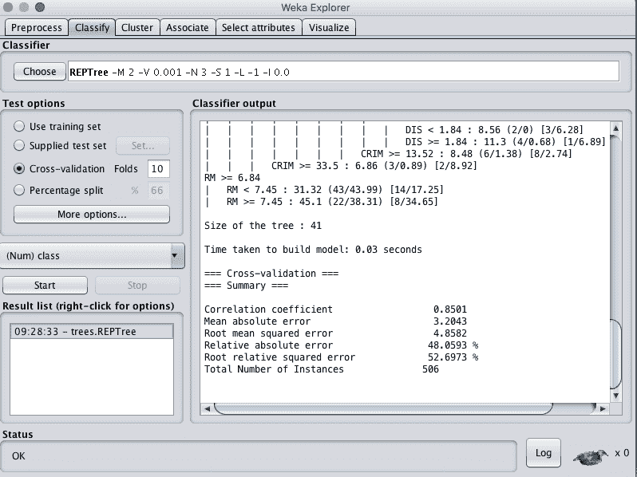
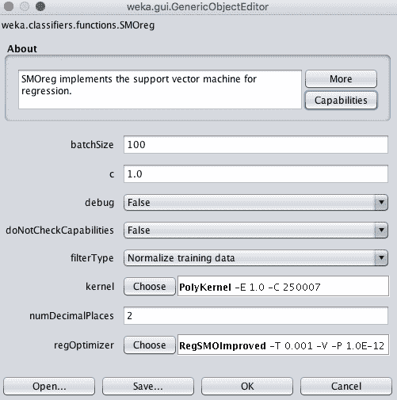
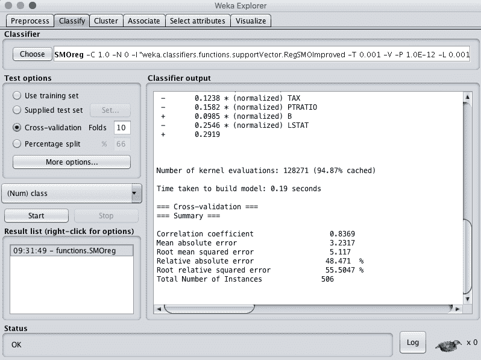
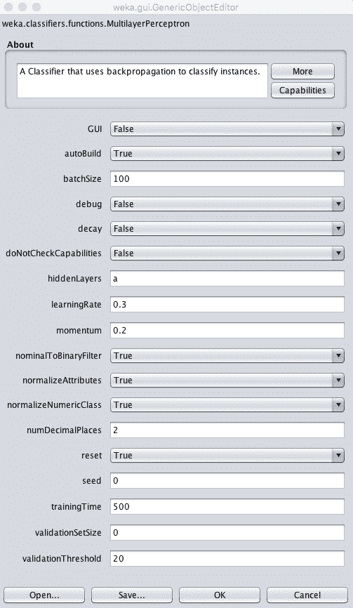

# 如何在 Weka 中使用回归机器学习算法

> 原文：<https://machinelearningmastery.com/use-regression-machine-learning-algorithms-weka/>

最后更新于 2019 年 8 月 22 日

Weka 平台上有大量可用的回归算法。

Weka 支持的大量机器学习算法是使用该平台的最大好处之一。

在这篇文章中，你将发现如何在 Weka 中使用顶级回归机器学习算法。

看完这篇文章你会知道:

*   Weka 支持的 5 个顶级回归算法左右。
*   如何在 Weka 中使用回归机器学习算法进行预测建模。
*   关于 Weka 中回归算法的关键配置选项。

**用我的新书[用 Weka](https://machinelearningmastery.com/machine-learning-mastery-weka/) 启动你的项目**，包括*的分步教程*和清晰的*截图*所有示例。

我们开始吧。

如何在 Weka
中使用回归机器学习算法。

## 回归算法综述

我们将带您参观 Weka 的 5 个顶级回归算法。

我们介绍的每种算法都将根据其工作原理进行简要描述，关键算法参数将突出显示，算法将在 Weka Explorer 界面中演示。

我们将回顾的 5 种算法是:

1.  线性回归
2.  k-最近邻
3.  决策图表
4.  支持向量机
5.  多层感知器

这 5 个算法可以作为你回归问题的起点。

一个标准的机器学习回归问题将被用来演示每个算法。

具体来说，波士顿房价数据集。每个实例都描述了波士顿郊区的房产，任务是以千美元为单位预测房价。有 13 个不同尺度的数值输入变量描述郊区的特性。您可以在 [UCI 机器学习资源库](https://archive.ics.uci.edu/ml/datasets/Housing)上了解更多关于该数据集的信息。

启动 Weka 浏览器:

1.  打开 Weka 图形用户界面选择器。
2.  单击“浏览器”按钮打开 Weka 浏览器。
3.  从 *housing.arff* 文件加载波士顿房价数据集。
4.  单击“分类”打开“分类”选项卡。

让我们从线性回归算法开始。

## 线性回归

线性回归只支持回归类型的问题。

它通过估计最适合训练数据的直线或超平面的系数来工作。这是一个非常简单的回归算法，训练速度很快，并且如果数据的输出变量是输入的线性组合，它可以有很好的表现。

最好先对您的问题进行线性回归评估，然后再使用更复杂的算法，以防它表现良好。

选择线性回归算法:

1.  单击“选择”按钮，选择“函数”组下的“线性回归”。
2.  单击算法名称查看算法配置。

线性回归的 Weka 构型

如果训练数据具有高度相关的输入属性，线性回归的表现可能会降低。Weka 可以通过将 eliminateColinearAttributes 设置为 True(默认值)来自动检测和移除高度相关的输入属性。

此外，与输出变量无关的属性也会对表现产生负面影响。Weka 可以通过设置 attributeSelectionMethod 自动执行特征选择，只选择那些相关的属性。这是默认启用的，可以禁用。

最后，Weka 实现使用脊正则化技术来降低学习模型的复杂性。它通过最小化学习系数的绝对和的平方来做到这一点，这将防止任何特定的系数变得太大(回归模型中复杂性的标志)。

1.  单击“确定”关闭算法配置。
2.  单击“开始”按钮，在波士顿房价数据集中运行该算法。

您可以看到，在默认配置下，线性回归的 RMSE 值为 4.9。

线性回归的 Weka 结果

## k-最近邻

k 近邻算法支持分类和回归。也简称 kNN。它的工作原理是存储整个训练数据集，并在进行预测时查询它来定位 k 个最相似的训练模式。

因此，除了原始训练数据集之外，没有其他模型，并且执行的唯一计算是在请求预测时查询训练数据集。

这是一个简单的算法，但是除了假设数据实例之间的距离在进行预测时有意义之外，它并没有对问题做出太多假设。因此，它通常会获得非常好的表现。

当对回归问题进行预测时，KNN 将取训练数据集中 k 个最相似实例的平均值。选择 KNN 算法:

1.  点击“选择”按钮，选择“懒惰”组下的“IBk”。
2.  单击算法名称查看算法配置。

在 Weka，KNN 被称为 IBk，代表基于实例的 k。

WEKA k-最近邻居配置

邻域的大小由 k 参数控制。例如，如果设置为 1，则使用与请求预测的给定新模式最相似的单一训练实例进行预测。k 的常用值是 3、7、11 和 21，对于较大的数据集，k 值较大。Weka 可以通过将 crossValidate 参数设置为 True，在算法内部使用交叉验证来自动发现 k 的一个好值。

另一个重要参数是使用的距离度量。这是在控制训练数据存储和搜索方式的近邻搜索算法中配置的。默认为线性搜索。单击此搜索算法的名称将提供另一个配置窗口，您可以在其中选择距离函数参数。默认情况下，欧氏距离用于计算实例之间的距离，这对于相同比例的数值数据很有好处。如果你的属性在度量或类型上不同，曼哈顿距离是很好的选择。

在你的问题上尝试一套不同的 k 值和距离度量是一个好主意，看看什么效果最好。

1.  单击“确定”关闭算法配置。
2.  单击“开始”按钮，在波士顿房价数据集中运行该算法。

您可以看到，在默认配置下，KNN 算法实现了 4.6 的 RMSE。

k 近邻算法的 Weka 回归结果

## 决策图表

决策树可以支持分类和回归问题。

决策树最近被称为分类和回归树或 CART。他们通过创建一棵树来评估一个数据实例，从树的根开始，将城镇移动到叶子(因为树是用反向透视绘制的，所以是根)，直到可以进行预测。创建决策树的过程是贪婪地选择最佳分割点以进行预测，并重复该过程，直到树达到固定深度。

在构建树之后，对其进行修剪，以提高模型概括新数据的能力。

选择决策树算法:

1.  单击“选择”按钮，选择“树”组下的“重新生成树”。
2.  单击算法名称查看算法配置。

决策树算法的 Weka 配置

树的深度是自动定义的，但是可以在 maxDepth 属性中指定深度。

您也可以通过将“不运行”参数设置为“真”来选择关闭修剪，尽管这可能会导致更差的表现。

minNum 参数定义了从训练数据构建树时，树在叶节点中支持的最小实例数。

1.  单击“确定”关闭算法配置。
2.  单击“开始”按钮，在波士顿房价数据集中运行该算法。

您可以看到，在默认配置下，决策树算法的 RMSE 值为 4.8。

决策树算法的 Weka 回归结果

## 支持向量回归

支持向量机是为二进制分类问题开发的，尽管该技术已经扩展到支持多类分类和回归问题。SVM 对回归的适应简称为支持向量回归或支持向量回归。

SVM 是为数字输入变量开发的，虽然会自动将标称值转换为数值。输入数据在使用前也要标准化。

不像 SVM 那样找到一条线来最好地将训练数据分成类，支持向量回归机的工作原理是找到一条最适合的线来最小化成本函数的误差。这是使用优化过程来完成的，该过程只考虑训练数据集中最接近具有最小成本的线的那些数据实例。这些实例被称为支持向量，因此得名。

在几乎所有感兴趣的问题中，都不能画出一条最适合数据的线，因此在这条线周围增加了一个余量来放松约束，允许一些不好的预测被容忍，但允许总体上有更好的结果。

最后，很少有数据集可以用一条直线拟合。有时需要标出一条有曲线甚至多边形区域的线。这是通过将数据投影到更高维度的空间来绘制线条和进行预测来实现的。不同的内核可以用来控制投影和灵活性。

选择支持向量回归算法:

1.  单击“选择”按钮，并在“功能”组下选择“SMOreg”。
2.  单击算法名称查看算法配置。

支持向量回归算法的 Weka 配置

在 Weka 中称为复杂性参数的 C 参数控制绘制线条以适合数据的过程的灵活性。值 0 不允许超出边距，而默认值为 1。

SVM 的一个关键参数是要使用的内核类型。最简单的核是线性核，它用直线或超平面分隔数据。Weka 中的缺省值是多项式核，它将使用曲线或摆动线来拟合数据，多项式越高，摆动越多(指数值)。

多项式核的默认指数为 1，这使得它相当于一个线性核。一种流行且强大的核是径向基核或径向基函数核，其能够学习封闭多边形和复杂形状来拟合训练数据。

在您的问题上尝试一套不同的内核和 C(复杂性)值是一个好主意，看看什么最有效。

1.  单击“确定”关闭算法配置。
2.  单击“开始”按钮，在波士顿房价数据集中运行该算法。

您可以看到，在默认配置下，支持向量回归算法实现了 5.1 的 RMSE。

支持向量回归算法的 Weka 回归结果

## 多层感知器

多层感知器算法支持回归和分类问题。

它也被称为人工神经网络或简称神经网络。

神经网络是一种用于预测建模的复杂算法，因为有太多配置参数只能通过直觉和大量试错来有效调整。

这是一种算法，灵感来自大脑中的生物神经网络模型，其中被称为神经元的小处理单元被组织成层，如果配置良好，这些层能够逼近任何功能。在分类中，我们感兴趣的是近似基础函数，以便最好地区分类别。在回归问题中，我们感兴趣的是逼近一个最适合真实值输出的函数。

选择多层感知器算法:

1.  单击“选择”按钮，并在“功能”组下选择“多层感知器”。
2.  单击算法名称查看算法配置。

多层感知器算法的 Weka 配置

您可以手动指定模型使用的神经网络的结构，但不建议初学者这样做。

默认值将自动设计网络，并在您的数据集上进行训练。默认情况下，将创建单个隐藏层网络。您可以在“隐藏层”参数中指定隐藏层的数量，默认设置为自动“a”。

您也可以使用图形用户界面来设计网络结构。这可能很有趣，但建议您使用简单训练的图形用户界面并测试训练数据的分割，否则您将被要求为交叉验证的 10 个折叠中的每一个设计一个网络。

多层感知器算法的 Weka 图形用户界面设计

您可以通过设置学习率来指定每个时期更新模型的量来配置学习过程。常用值很小，例如介于 0.3(默认值)和 0.1 之间的值。

学习过程可以进一步调整动量(默认设置为 0.2)以继续更新权重，即使不需要进行任何更改，以及衰减(设置衰减为真)，这将随着时间的推移降低学习率，以便在训练开始时执行更多的学习，而在结束时执行更少的学习。

1.  单击“确定”关闭算法配置。
2.  单击“开始”按钮，在波士顿房价数据集中运行该算法。

您可以看到，在默认配置下，多层感知器算法实现了 4.7 的 RMSE。

Weka 回归结果多层感知器算法

## 摘要

在这篇文章中，你发现了 Weka 中的回归算法。

具体来说，您了解到:

*   大约 5 种最常用的回归算法可以用于预测建模。
*   如何在 Weka 中运行回归算法？
*   关于 Weka 中回归算法的关键配置选项。

你对 Weka 里的回归算法或者这个帖子有什么疑问吗？在评论中提问，我会尽力回答。