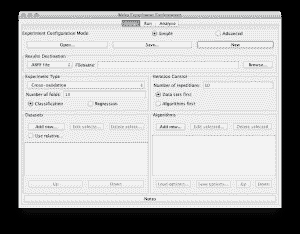
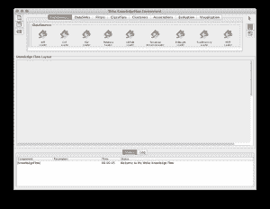

# 什么是 Weka 机器学习工作台

> 原文：<https://machinelearningmastery.com/what-is-the-weka-machine-learning-workbench/>

最后更新于 2020 年 12 月 10 日

机器学习是一个迭代的过程，而不是一个线性的过程，随着对所研究问题的了解越来越多，需要重新审视每一步。这个迭代过程可能需要为每个过程使用许多不同的工具、程序和脚本。

机器学习工作台是一个平台或环境，支持和促进一系列机器学习活动，减少或消除对多种工具的需求。

像 R 这样的一些统计和机器学习工作台提供了非常先进的工具，但是需要大量的脚本和编程形式的手动配置。这些工具也可能是脆弱的，由学者编写或为学者编写，而不是编写为健壮的并在生产环境中使用。

**用我的新书[用 Weka](https://machinelearningmastery.com/machine-learning-mastery-weka/) 启动你的项目**，包括*的分步教程*和清晰的*截图*所有示例。

## 什么是 Weka

[Weka 机器学习工作台](https://waikato.github.io/weka-wiki/)是一个现代化的应用机器学习平台。Weka 是一个缩写，代表怀卡托知识分析环境。这也是一种新西兰鸟“T2”的名字。

我喜欢宣传的 Weka 的五个特点是:

*   **开源**:在 GNU GPL 下作为开源软件发布。它是双重许可的，Pentaho 公司拥有在自己的产品中使用商业智能平台的独家许可。
*   **图形界面**:有图形用户界面(GUI)。这让你不用编程就能完成你的机器学习项目。
*   **命令行界面**:软件的所有功能都可以从命令行使用。这对于编写大型作业的脚本非常有用。
*   **Java API** :它是用 Java 编写的，提供了一个有很好文档记录的 API，可以促进集成到您自己的应用程序中。请注意，GNU GPL 意味着反过来你的软件也必须作为 GPL 发布。
*   **文档**:有书籍、手册、wikis、MOOC 课程可以训练你如何有效使用平台。

我推广 Weka 的主要原因是因为初学者可以使用图形界面完成应用机器学习的过程，而无需进行任何编程。这是一件大事，因为掌握流程、处理数据和实验算法是初学者应该学习的，而不是学习另一种脚本语言。

## Weka 图形用户界面简介

现在我想展示一下图形用户界面，并鼓励您下载并与 Weka 一起玩。工作台提供了三种解决问题的主要方法:**探索者**用于玩游戏和尝试，而**实验者**用于受控实验，而**知识流**用于为你的问题图形化地设计一个管道。

Weka 加载器接口

### Weka 探险家

探索者是你处理你的数据，思考什么样的转换应用到你的数据，什么样的算法你想在实验中运行的地方。

Weka 浏览器界面

浏览器界面分为 5 个不同的选项卡:

*   **预处理**:加载一个数据集，将数据操作成你想要使用的表单。
*   **分类**:选择并运行分类和回归算法，对你的数据进行运算。
*   **聚类**:在数据集上选择并运行聚类算法。
*   **关联**:运行关联算法，从数据中提取洞察。
*   **选择属性**:对你的数据运行属性选择算法，选择那些与你想要预测的特征相关的属性。
*   **可视化**:可视化属性之间的关系。

### Weka 实验者

这个界面用于设计你选择的算法和数据集的实验，运行实验和分析结果。

Weka 实验者界面

用于分析结果的工具非常强大，允许您考虑和比较在多次运行中具有统计意义的结果。

### 知识流动

应用机器学习是一个过程，知识流界面允许您以图形方式设计该过程，并运行您创建的设计。这包括输入数据的加载和转换、算法的运行和结果的呈现。

Weka 知识流界面

这是用图形解决复杂问题的强大界面和隐喻。

## 入门技巧

以下是一些快速起床和跑步的建议:

### 立即下载 Weka

它支持三个主要平台:视窗、OS X 和 Linux。找到适合您平台的发行版，下载、安装并启动它。您可能必须首先安装 Java。该安装包括许多标准实验数据集(在数据目录中)，您可以加载和练习。

*   [下载安装 Java](https://java.com)
*   [下载并安装 Weka](https://waikato.github.io/weka-wiki/downloading_weka/)

### 阅读 Weka 文档

下载包括一个 PDF 手册(WekaManual.pdf)，可以让你很快跟上速度。它非常详细和全面的截图。网上有大量的补充文档，请查看:

*   [Weka Wiki](https://waikato.github.io/weka-wiki/)
*   [Weka 社区文档](http://wiki.pentaho.com/display/DATAMINING/Pentaho+Data+Mining+Community+Documentation)
*   [Weka 常见问题](https://waikato.github.io/weka-wiki/faq/)
*   [Weka 邮件列表](http://list.waikato.ac.nz/mailman/listinfo/wekalist)

别忘了书。如果你进入了 Weka，那么[买本书](https://amzn.to/340LRLA)。它提供了对应用机器学习的介绍以及对 Weka 平台本身的介绍。强烈推荐。

### Weka 的扩展和插件

有很多插件算法、扩展甚至平台都建立在 Weka 之上:

*   [更多数据集](https://sourceforge.net/projects/weka/files/datasets/)
*   [更多套餐](https://waikato.github.io/weka-wiki/packages/)

### Weka 在线课程

有两门在线课程用 Weka 教授数据挖掘:

*   [用 Weka](http://weka.waikato.ac.nz/) 进行数据挖掘。你可以在 YouTube 上免费观看本课程的所有视频。
*   [使用 Weka](https://weka.waikato.ac.nz/moredataminingwithweka) 进行更多数据挖掘。

[Rushdi Shams](https://sites.google.com/site/rushdishams/) 有一个令人惊叹的 YouTube 视频通道，向您展示如何在 Weka 中完成许多特定任务。点击这里查看他的 [Weka YouTube 通道。](https://www.youtube.com/user/rushdishams/videos)

你用过 Weka 吗？留下评论，分享你的经历。